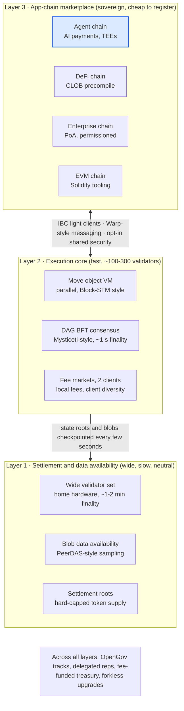
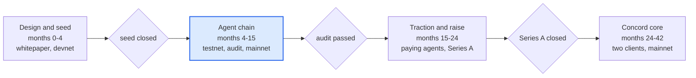

# Composite Blockchain Study — Design, Feasibility & Costs

28 September 2026 · Gareth Oyston, Machine Quotient Ltd

## Executive summary

The best of the surveyed chains can be combined into one coherent design, but it is not a single monolithic chain. The composite that holds together is a **three-layer network**: a small, slow, maximally decentralised settlement layer (Bitcoin/Ethereum lesson), a fast parallel-execution core with sub-second BFT finality (Solana/Sui/Aptos lesson), and a marketplace of sovereign app-chains that plug in via light-client interoperability (Cosmos/Avalanche/Polkadot lesson), all under on-chain governance with a protocol treasury (Cardano/Polkadot lesson). Working name in this study: **Concord**.

The design is technically feasible in 2026 because every component exists in open source. The hard problems are money, team and distribution, not cryptography.

- **Feasibility verdict**: a sovereign L1 of this ambition is a *fundraising* problem first. Comparable launches (Aptos, Sui, Monad, Berachain) raised $100M-$300M+ and took 12-36 months with 20-80 engineers. A one-person company cannot ship it directly.
- **Costs**: three credible routes. (1) *Lean route* — an app-chain or rollup using an existing stack, AI-payments focus: roughly **$0.6M-1.5M** over 18 months. (2) *Sovereign L1, minimum credible team* — **$8M-25M** to mainnet over 24-30 months. (3) *Top-tier L1 at Aptos/Sui scale* — **$100M+**. Figures are USD; UK salaries in GBP where sourced.
- **Strongest use case**: agent-native payments and accounts for AI (x402-style metering, streaming micropayments, TEE-attested agent wallets). This is the one AI feature with a real protocol-level argument; compute marketplaces and agent frameworks do not need a new chain.
- **Recommendation**: do not start with an L1. Start with the *Concord Agent Layer* as a Cosmos-SDK or Avalanche-L1 app-chain (or an OP-Stack rollup) that proves the AI-payments thesis, publish the full composite architecture as a whitepaper, and use traction to raise the round that funds the sovereign core. Regulation (UK regime live 25 Oct 2027, MiCA in force, US CLARITY stalled) favours a foundation-plus-UK-devco structure with no US retail sale.

## What each chain does best, and what it paid for it

No surveyed chain wins on more than two axes; each strength was bought with a specific trade-off. Live throughput figures are Chainspect rolling measurements (28 Sep 2026) and reflect demand, not capacity; theoretical ceilings are in the last column. Market caps from Slickcharts, TVL from DefiLlama, same date.

| Chain | Best-in-class at | Trade-off accepted | Consensus / finality | Execution model | Live TPS / ceiling | Avg fee | Mkt cap / TVL |
| --- | --- | --- | --- | --- | --- | --- | --- |
| [Bitcoin](https://chainspect.app/chain/bitcoin) | Security, credible neutrality, fixed monetary policy | Near-zero programmability; \~1 h probabilistic finality; Lightning capacity shrinking (\~4,900 BTC) | PoW, \~1 h (6 conf) | UTXO, Script | 14 / \~7 | $0.28 | $1.70T / $4.5B |
| [Ethereum](https://ethereum.org/roadmap/) | Liquidity, developer base, decentralisation (1.36M validators) | 12.8 min finality; fragmented L2 landscape; no treasury | PoS, 2-epoch checkpoint | EVM, account, sequential L1 | 18 / 238 | $0.19 | $328B / $53.4B |
| [Cardano](https://cardano.org/news/2026-05-14-cardano-is-ready-to-grow/) | Formal rigour; on-chain constitution, DReps and treasury (Voltaire) | Very low throughput until Leios ships (testnet); slow delivery | Ouroboros PoS, \~2 min | eUTXO, Plutus | 0.3 / 18 | $0.076 | $9.4B / $66M |
| [Polkadot](https://chainspect.app/chain/polkadot) | Shared security; validator decentralisation (Nakamoto 177); OpenGov treasury | Thin DeFi; JAM not until 2027 | NPoS + GRANDPA, \~30 s | Per-parachain WASM runtimes | 0.02 / 1,000 | $0.018 | $2.2B / \~$0 |
| [Solana](https://blockeden.xyz/blog/2026/02/26/solana-firedancer-alpenglow-1m-tps/) | Realised throughput; sub-cent fees; Alpenglow 100-150 ms finality target | Heavy validator hardware; client concentration (Firedancer \~21% stake); outage history | PoS + PoH, Alpenglow | Sealevel, parallel, account | 2,556 / 65,000 | $0.005 | $72.3B / $6.7B |
| [Avalanche](https://support.avax.network/en/articles/9868736-what-is-avalanche9000) | Cheap sovereign L1 launch after Avalanche9000 (1-10 AVAX/month); 2 s finality; Warp messaging | Liquidity and security fragmented across L1s | Snowman++, \~2 s | EVM or custom VM per L1 | 3 / 1,191 | $0.074 | $4.9B / $633M |
| [Cosmos](https://cosmos.network/blog/the-cosmos-stack-roadmap-2026) | IBC: the most trust-minimised interop (light clients, now Attestor, IFT, GMP); instant finality | No single chain, TPS or TVL to market; each zone secures itself | CometBFT, single-slot | Cosmos SDK, BlockSTM coming | 5,000 target (per zone) | low | $1.0B (ATOM) |
| [Sui](https://www.sui.io/blog/mysticeti-v2-sui-consensus) | Object model: parallel execution and near-instant fast path; Mysticeti v2 DAG consensus | Newer Move dialect; \~100-130 validators | Mysticeti, \~0.65-1 s | Move, object-centric | 75 / 120,000 | \~$0.001 | $5.3B / $564M |
| [Aptos](https://chainspect.app/chain/aptos) | Block-STM optimistic parallelism; cheapest fees surveyed; 38 ms blocks | 86 validators; tiny TVL relative to capacity | AptosBFT, sub-second | Move, account, Block-STM | 103 / 160,000 | $0.0006 | $750M / $55M |
| [Near](https://chainspect.app/chain/near) | Dynamic resharding (Nightshade 2.0); chain abstraction and intents | Headroom mostly unused; narrative drift toward AI | Nightshade + Doomslug, \~1.2 s | Sharded, account | 13 / 1,000,000 (theoretical) | $0.007 | $7.2B / $251M |
| [Hyperliquid](https://cleansky.io/blog/hyperliquid-architecture-hypercore-hyperevm-2026/) | Vertical integration: on-chain order book plus EVM reading it directly; 70 ms finality | 21 validators; almost no interop | HyperBFT (pipelined HotStuff) | HyperCore CLOB + HyperEVM | 200,000+ (claimed) | low | $23.1B / $1.24B |

Two patterns matter for the composite. First, the gap between live and theoretical TPS on Solana, Sui, Aptos and Near shows that raw capacity is no longer the bottleneck; distribution and liquidity are. Second, the chains with treasuries and on-chain governance (Cardano, Polkadot, Cosmos) have the weakest DeFi traction, while the chains with the strongest traction (Ethereum, Solana, Hyperliquid) govern informally. Governance rigour has not yet bought adoption.

## Design principles: what to take, what to leave

Some "bests" cannot coexist in one layer, so the composite separates them into layers that each optimise for one thing. The trilemma still applies inside each layer; it is dodged across layers.

**Mutually exclusive pairs, and how Concord resolves them**

| Tension | Why one layer cannot have both | Resolution |
| --- | --- | --- |
| Bitcoin-grade decentralisation vs Solana-grade speed | Sub-second BFT needs \~100-700 well-provisioned validators; thousands of home validators need slow, simple consensus | Slow, wide settlement layer; fast, narrower execution core that checkpoints into it |
| Fixed monetary policy (BTC) vs funded treasury (ADA, DOT) | A treasury needs ongoing issuance or fee capture; a hard cap forbids it | Capped total supply, but a fixed slice of *fees* (not inflation) funds the treasury; issuance decays to zero |
| UTXO/object parallelism vs account-model composability | DeFi composability wants shared mutable state; parallelism wants disjoint state | Sui-style object model with explicit shared objects; Move VM; EVM available as a second VM on app-chains, not in the core |
| Sovereign app-chains (Cosmos, Avalanche) vs shared security (Polkadot) | Sovereignty means self-secured; shared security means a permissioned slot | Opt-in shared security (Polkadot-style) rented by core stake, IBC-style light-client interop either way |
| Formal verification (Cardano) vs shipping cadence | Proofs take years; markets move in months | Formally verify only the consensus and the token/bridge contracts; audit the rest conventionally |

**What Concord takes from each chain**

- Bitcoin: hard supply cap, credible neutrality, a light-client-verifiable settlement root.
- Ethereum: rollup-centric scaling with blob data availability (PeerDAS), account abstraction, the largest tooling and audit ecosystem.
- Cardano: eUTXO determinism (fees and outcomes known before submission), on-chain constitution with delegated representatives.
- Polkadot: forkless runtime upgrades, opt-in shared security, track-based OpenGov.
- Solana: local fee markets, parallel scheduler, a second independent validator client from day one.
- Avalanche: cheap sovereign L1 registration (a monthly fee, not a 2,000-token stake), Warp-style native messaging.
- Cosmos: IBC as the interoperability standard, including Attestor light clients to reach chains without native ones.
- Sui/Aptos: object-centric Move for the execution core, DAG-based BFT (Mysticeti) with a fast path for uncontended transactions.
- Near: dynamic resharding as the long-term scaling path for the core; chain-abstracted accounts and intents.
- Hyperliquid: native order-book precompile readable from smart contracts; dual block cadence (fast small blocks, slow large blocks).

**What Concord leaves out**: proof-of-work (energy and hardware centralisation without the incumbency benefit), proof-of-history as a separate primitive (Alpenglow shows it is not needed), a single dominant client, a 2,000-token validator bond per app-chain, and inflation-funded treasuries.

## Proposed architecture

Concord is a three-layer network with one token and one governance system. Each layer takes the property the surveyed chains proved can be had only by giving something else up.

App-chains settle through the execution core; the core checkpoints into the settlement layer, whose wide validator set gives finality that no single fast chain can. The Agent chain is the first app-chain and the go-to-market wedge (see Use cases).

**Layer 1 — Settlement and data availability.** Proof-of-stake with a deliberately low hardware bar so thousands of validators can run on home hardware, slow finality (1-2 minutes, Ethereum-style checkpoints) and blob data availability using PeerDAS-style sampling. It stores state roots of the core and app-chains and the canonical token ledger. Its consensus is the one component worth formally verifying, Cardano-style.

**Layer 2 — Execution core.** A Move VM with Sui's object model (owned objects execute in parallel with no consensus on the fast path; shared objects are ordered), a Mysticeti-style DAG BFT with \~1 s finality, Solana-style local fee markets so one hot contract cannot price out the chain, and two independent validator clients from mainnet (the lesson from Solana's Firedancer effort and Ethereum's client diversity). Validator set \~100-300, staked in the native token. A Hyperliquid-style order-book precompile is exposed so DeFi contracts read the book directly.

**Layer 3 — App-chain marketplace.** Anyone registers a sovereign chain for a monthly fee (Avalanche9000 model) rather than a slot auction. Chains choose their VM (Move, EVM, CosmWasm, custom) and either secure themselves or rent shared security from core stake (Polkadot model). Interop is IBC with Attestor light clients, so app-chains and outside chains (Ethereum, Solana, Bitcoin via light-client bridges) are reached the same way.

**Governance and treasury.** Track-based referenda (OpenGov) with delegated representatives and a constitutional committee (Cardano CIP-1694); runtime upgrades are forkless (Polkadot). The treasury is funded from a fixed share of fees on all three layers, not from inflation.

**Token model (CON).** Hard-capped supply. Issuance funds staking rewards on a decaying schedule and reaches zero; thereafter validators earn fees only. Fees are paid in CON on Layer 1 and 2; app-chains may use their own gas token but pay registration and shared-security rent in CON. A portion of base fees is burned (EIP-1559), a portion goes to treasury. Allocation, vesting and any sale are open questions for the legal phase (see Feasibility).

**Accounts.** Native account abstraction with agent accounts: keys can be held in TEEs with on-chain attestation, spending policies and streaming-payment channels are first-class objects. This is the one piece that is new rather than borrowed.

## Use cases: standalone and combined

Only one use case has both a real protocol-level argument and unmet demand: payments and accounts for AI agents. The rest are served, today, by existing chains, and Concord would compete on execution rather than on a missing capability.

| Use case | What Concord offers | Needs a new chain? | Demand today | Standalone or combined |
| --- | --- | --- | --- | --- |
| AI agent payments and accounts | Agent-native accounts (TEE-attested keys, spending policies), streaming micropayment channels, x402-style HTTP metering settled in \~1 s for sub-cent fees | Yes, partly: agent accounts and payment channels benefit from base-layer support | Rails exist ([x402](https://www.coinbase.com/developer-platform/products/x402), Skyfire, Google AP2, Visa/Mastercard pilots) but volume is still thin ([CoinDesk, Mar 2026](https://www.coindesk.com/markets/2026/03/11/coinbase-backed-ai-payments-protocol-wants-to-fix-micropayment-but-demand-is-just-not-there-yet)) | Standalone wedge: the Agent chain can ship first |
| Verifiable inference (zkML/opML) | Verifier precompiles for EZKL-style proofs; opML dispute games | No: a verifier contract on any chain suffices; proving cost, not chain design, is the blocker | Small models only; research-stage for LLMs | Combined: a feature of the Agent chain, not a product |
| Decentralised compute (Akash, io.net, Render) | Marketplace, reputation and slashing contracts | No | Modest; niche for latency-tolerant workloads | Combined: an app on the Agent or DeFi chain |
| Agent frameworks and tokenised agents (Virtuals, ElizaOS, ASI) | Cheap issuance, revenue-sharing objects | No | Real but memecoin-driven monetisation | Combined: ecosystem apps |
| AI data and IP provenance (Ocean, Story) | Provenance graphs and programmable royalties as objects | Weak yes: unbypassable royalty enforcement is a protocol argument | Story raised \~$140M+ but is commercially unproven | Combined: a second app-chain later |
| DeFi: spot and perps | Native order-book precompile (Hyperliquid model) readable by Move contracts; 1 s finality; local fee markets | No: Hyperliquid, Solana and Ethereum L2s already do this | Very large ($53B TVL on Ethereum, $6.7B Solana, $1.2B Hyperliquid) | Combined: needs the liquidity the Agent chain brings, or a Hyperliquid-style exchange team |
| Payments and stablecoins | Sub-cent fees, deterministic eUTXO-style fee quoting, instant finality; stablecoin issuance under the UK regime (£350k own funds, T+1 redemption) | No | Large and regulated; stablecoins are the one asset class with clear rules in UK, EU and US | Combined: the settlement asset for agent payments |
| Tokenised real-world assets | Permissioned app-chains (PoA), compliance hooks, IBC to public liquidity | No | Growing, bank-led | Standalone app-chain sold to institutions |
| Enterprise and public sector | Sovereign PoA chains with forkless upgrades and optional shared security | No | Steady but slow sales cycles | Standalone app-chain |

**Combined thesis.** The layers compound: agents pay in stablecoins (payments), trade on the order-book precompile (DeFi), verify model outputs on-chain (AI), and everything settles into a neutral root (cryptocurrency). Standalone, only the Agent chain and the enterprise/RWA app-chains have a sales motion a small team can run. A general-purpose L1 competing on "best of all chains" has no distribution advantage against Ethereum, Solana and Sui, which are already fast, cheap and liquid.

## Feasibility

Technically feasible; economically feasible only with outside capital; regulatorily workable from the UK with the right structure. Competitively the hardest part.

**Technical.** Every component of Concord exists as production open source: Mysticeti and the Move object model (Sui, Apache-2.0), Block-STM (Aptos), CometBFT and IBC (Cosmos), Substrate's forkless upgrades and OpenGov (Polkadot), PeerDAS (Ethereum), the Avalanche L1 registration model. The novel engineering is integration and the agent-account layer, roughly 15-25% of the code. Two independent clients double the core engineering cost but are non-negotiable given Solana's and Ethereum's client-concentration history. Comparable teams took 12-36 months to mainnet ([Aptos](https://www.coindesk.com/business/2022/07/25/aptos-labs-raises-150m-to-revive-diem-in-ftx-ventures-led-funding-round) \~12 months with an ex-Meta team; [Sui](https://www.theblock.co/post/229236/mysten-labs-sui-mainnet) \~24 months; Monad \~30 months).

**Build options, ranked by cost and how much of the design they keep**

| Route | Stack | Keeps of the design | Team to mainnet | Time | Cash to mainnet (USD) |
| --- | --- | --- | --- | --- | --- |
| A. Agent app-chain first | Cosmos SDK + CometBFT (Go) or Avalanche L1 / HyperSDK; IBC from day one | Agent accounts, payment channels, IBC interop; borrows security | 3-5 engineers + founder | 9-15 months | $0.6M-1.5M |
| A'. Agent rollup | OP Stack or Arbitrum Orbit via RaaS (Conduit, Caldera, AltLayer) | Same features on Ethereum security; not an L1 | 2-4 engineers | 4-9 months | $0.4M-1.0M (RaaS quoted on request; low-to-mid five figures per month) |
| B. Sovereign core + settlement | Fork Sui (Move, Mysticeti) for the core; Substrate or CometBFT for settlement; IBC | Full three-layer design, single client at launch | 12-20 engineers | 24-30 months | $8M-25M |
| C. Top-tier L1 | Custom clients, two implementations, formal verification of consensus | Everything | 30-80 engineers | 24-36 months | $100M+ (Aptos $150M+, Sui $300M+, Monad \~$225M, Berachain \~$100M) |

**Economic.** A one-person company is two orders of magnitude below the team size of any launched L1. Route A is fundable from a UK pre-seed/seed (£500k-£1.5M) plus grants (Cosmos, Avalanche and Optimism all run app-chain grant programmes). Route B needs a Series A led by crypto-native funds and a token warrant; that round is raised on a whitepaper, a testnet and early Agent-chain traction, which is why A precedes B. Validator bootstrapping is routinely the last thing to de-risk; budget low-to-mid six figures for delegation programmes in year one.

**Regulatory (UK founder).**

- UK: FCA final rules published 30 June 2026; authorisation applications open 30 Sep 2026; the regime is in force from **25 October 2027** ([FCA](https://www.fca.org.uk/firms/new-regime-cryptoasset-regulation), [Skadden](https://www.skadden.com/insights/publications/2026/07/fca-finalises-core-rules-for-the-uk-cryptoasset-regime)). Financial-promotion rules (risk warnings, 24-hour cooling-off) have applied since Oct 2023 and cover any UK-directed token marketing now. Truly decentralised protocols with no identifiable controlling persons sit outside scope; this shapes the foundation design. Issuing a stablecoin needs £350k own funds and T+1 redemption.
- EU: MiCA fully in force since 30 Dec 2024; 199 CASPs licensed by April 2026; a Title II white paper is needed for an EU-facing native-token offer ([Binar](https://binar.com/insights/mica-april-2026-eu-crypto-market/)).
- US: GENIUS Act covers stablecoins; the CLARITY market-structure bill passed the House 294-134 but was stalled in the Senate as of March 2026 ([KuCoin summary](https://www.kucoin.com/blog/en-2026-clarity-act-the-lastest-status-and-update)). Until it passes, exclude US persons from any sale or airdrop.
- Structure: Swiss or Cayman foundation holds IP and treasury; Machine Quotient Ltd as the UK development company under a services agreement; token legal opinion before any generation event.

**Competitive.** Sui, Aptos and Solana already deliver the execution-core properties; Cosmos and Avalanche already sell app-chains; Ethereum owns liquidity. Concord's defensible position is the agent layer plus the neutral settlement root, not speed. If Coinbase's x402 or a Base-native agent standard reaches volume first, the wedge narrows to interop and neutrality, which are harder to sell.

## Costs and timeline

Route A (Agent chain) costs about $1.0M over 15 months at the mid-point; Route B (sovereign core) about $15M over a further 24-30 months. Figures are USD, 2026 prices; salaries assume a UK-based team with some remote hires. Sourced ranges are marked; the rest are estimates to be replaced by quotes.

**Route A — Agent app-chain, 15 months to mainnet**

| Line item | Basis | Low (USD) | High (USD) |
| --- | --- | --- | --- |
| Engineering: 3-5 protocol/Go/Rust engineers | UK senior protocol/Rust £90k-160k base; UK cryptography median £70k ([IT Jobs Watch](https://www.itjobswatch.co.uk/jobs/uk/cryptography.do)); 12-15 months | 400,000 | 850,000 |
| Founder and 1 business/ecosystem hire | 15 months | 60,000 | 150,000 |
| Security audits: chain modules, agent-account and channel contracts, bridge | Mid-tier to bridge tier, 2 rounds ([7BlockLabs 2026 rates](https://www.7blocklabs.com/blog/smart-contract-audit-cost-range-2026-and-trail-of-bits-smart-contract-audit-cost-benchmarks)) | 60,000 | 200,000 |
| Infra: testnet and mainnet nodes, RPC, explorer, monitoring | Cloud plus bare metal | 30,000 | 90,000 |
| Validator bootstrapping and delegation programme | Estimate; year one | 50,000 | 200,000 |
| Legal: foundation set-up, token legal opinion, UK financial-promotion review | Swiss CHF 20k-60k set-up or Cayman low tens of thousands; opinion $50k-250k (estimates) | 80,000 | 300,000 |
| Grants offset (Cosmos, Avalanche, Optimism programmes) | Typical app-chain grants | -50,000 | -200,000 |
| **Total** |  | **630,000** | **1,590,000** |

**Route B — Sovereign core and settlement layer, 24-30 months after Route A**

| Line item | Basis | Low (USD) | High (USD) |
| --- | --- | --- | --- |
| Engineering: 12-20 engineers incl. second client team | Mixed UK/US; US senior protocol $180k-350k (estimate) | 5,000,000 | 14,000,000 |
| Formal verification of settlement consensus | Specialist firm, 6-12 months | 300,000 | 1,000,000 |
| Audits: consensus, VM integration, bridges, token | $300k-1M+ all-in for a full L1 (sourced range), multiple firms | 500,000 | 1,500,000 |
| Bug bounty and testnet incentives | Immunefi-style programme | 200,000 | 1,000,000 |
| Validator and ecosystem programme | Delegation, grants for first app-chains | 500,000 | 2,500,000 |
| Legal and compliance: MiCA white paper, UK authorisation if in scope, US exclusion | Multi-jurisdiction | 300,000 | 1,000,000 |
| Liquidity and listings | Contentious and hard to verify; six to seven figures for a tier-1 venue | 500,000 | 3,000,000 |
| Operations, marketing, foundation running costs | 30 months | 700,000 | 2,000,000 |
| **Total** |  | **8,000,000** | **26,000,000** |

Each gate is a funding or safety condition, not a date: the Agent chain does not go to mainnet without a passed audit, and the core build does not start without the Series A. The slips seen elsewhere (performance targets missed, validator recruitment late, tokenomics disputes) are budgeted as the high-end figures and a 6-month buffer inside phase 4.

**Staffing at each phase.** Phase 1: founder + 1 contractor. Phase 2: 3-5 engineers, 1 ecosystem lead, fractional counsel. Phase 3: same plus a head of growth. Phase 4: 12-20 engineers in two client teams, 2 researchers, 3-4 ecosystem and operations, general counsel. Runway rule: raise 18 months of burn at each gate.

## Enrichment: audit of chains in development (added 28 Sep 2026)

Of 30 chains launched or in testnet since 2025, seven carry mechanisms worth adding to Concord now, five are worth a research track, and the rest either duplicate what Concord already has or solve a problem Concord does not have. The strongest signal from the set is that Concord's agent layer is under-scoped relative to what Tempo, Arc and the AI-compute chains are shipping, and that post-quantum signatures have become a genesis decision rather than a retrofit.

**Chain-by-chain audit**

| Chain | Status | Novel mechanism | Verdict for Concord |
| --- | --- | --- | --- |
| [Monad](https://www.monad.xyz/announcements/parallel-execution-monad) | Mainnet 2026 | Parallel EVM via dependency analysis, pipelined MonadBFT | Nothing new; Block-STM already covers it |
| [MegaETH](https://www.megaeth.com/) | Mainnet Apr 2026 | Node-role specialisation; single high-spec sequencer streaming state at <10 ms | Study the push-based state-streaming API; reject the centralised sequencer |
| [Sei Giga](https://everstake.com/resources/blog/sei-giga-upgrade-50x-faster-execution-for-the-evm-era) | Rolling out 2026 | Autobahn multi-proposer consensus; SeiDB storage built for concurrent access | Multi-proposer already in Mysticeti; storage engine design worth borrowing |
| Berachain | Mainnet Feb 2025 | Proof of Liquidity: validator rewards routed to LPs | Reject: couples security to DeFi incentives; mixed results |
| [Initia](https://www.figment.io/insights/initia-first-look-a-network-for-interwoven-rollups/) | Mainnet 2025 | Interwoven rollups with enshrined liquidity | Validation of the app-chain model; nothing new |
| Story Protocol | Mainnet | IP graph with royalty cascading to derivatives | Optional precompile for a data-licensing economy; defer |
| Movement | Mainnet beta | Move VM on Ethereum-aligned L2 | Nothing new; validates the Move bet |
| [Tempo](https://www.coindesk.com/tech/2026/03/18/stripe-led-payments-blockchain-tempo-goes-live-with-protocol-for-ai-agents) (Stripe, Paradigm) | Mainnet Mar 2026 | Machine Payments Protocol for autonomous agent payments | Adopt: make the agent layer speak MPP and x402 rather than a Concord-only format |
| [Plasma](https://www.plasma.org/company/blog/plasma-mainnet-beta-and-xpl) | Mainnet beta, \~$2B stablecoin liquidity | Zero-fee stablecoin transfers via protocol-subsidised relay; PlasmaBFT | Adopt: a rate-limited zero-fee lane for whitelisted assets |
| [Arc](https://www.arc.io/blog/arc-mainnet-goes-live-on-september-16-2026) (Circle) | Mainnet 16 Sep 2026; BlackRock, DTCC validators | Gas paid in USDC; permissioned validators; built for agentic and FX settlement | Adopt: stablecoin-denominated fees via paymaster; note the institutional competitor |
| Stable, Codex | Mainnet / beta | Stablecoin-native L1s (USDT, USDC) | Nothing new beyond Plasma and Arc; confirms the trend |
| [Aztec](https://aztec.network/blog/road-to-mainnet) | Alpha | Client-side ZK proving; mixed public/private contracts | Research track: optional shielded execution mode |
| [Namada](https://namada.net/blog/namada-mainnet-is-live) | Mainnet | Multi-asset shielded pool; users are paid to shield | Research track: elegant, but conflicts with UK/EU AML posture for a regulated launch |
| Penumbra | Mainnet | Shielded staking; encrypted order flow, batch clearing | Adopt the sealed-order idea in the order-book precompile |
| [Zama fhEVM](https://docs.zama.org/protocol/protocol/overview) | Live on EVM chains | FHE compute on ciphertext; threshold-MPC key management | Research track: too slow today, no hardware trust needed |
| Mina | Mainnet, Mesa roadmap | Recursive SNARK of the whole chain (\~22 kB) | Research track: recursive proof of settlement for light-client bridges |
| [Fuel](https://docs.fuel.network/docs/fuel-book/the-architecture/the-fuelvm/) | Mainnet | Declared access lists give conflict-free parallelism with no rollback | Already covered: Concord transactions declare read/write sets; sharpen the spec so declared transactions skip optimistic execution |
| [Linera](https://linera.dev/protocol/overview.html) | Testnet | One microchain per user, validator-internal messaging, geographic pinning | Defer: the owned-object fast path gives the same per-user parallelism; revisit if app-chain registration proves too heavy for agents |
| Eclipse | Mainnet | SVM execution, Ethereum settlement, Celestia DA | Nothing new; modular validation |
| Sonic | Mainnet | FeeM: fee share rebated to app developers by usage | Optional: developer fee rebate as a treasury bounty; cheap |
| Unichain | Mainnet | Flashblocks 200 ms soft-confirms; verifiable block building rebating MEV to LPs | Adopt the MEV-rebate rule for the order-book precompile |
| OP Superchain / Base | Live | Standardised interop and revenue compact across member chains | Defer: a middle tier between registration and shared security; governance work, not cryptography |
| Espresso | Live | Shared decentralised sequencer as an opt-in service | Defer: offer as an app-chain service in phase 5 |
| Celestia, Avail | Live | DA with sampling; price competition | Nothing new; use as DA price benchmarks |
| [Ika](https://www.sui.io/blog/ika-dwallet-mpc-network-interoperability) (dWallet, on Sui) | Live | 2PC-MPC threshold custody, sub-second signing; contracts hold foreign-chain assets natively | Adopt in phase 3: MPC as a second custody model beside TEEs, and as bridgeless custody of BTC/ETH |
| Ritual, Sahara AI, 0G | Mainnets 2025-26 | Verifiable inference markets, data-contribution rewards, AI storage | Adopt scoped: a compute-and-data market object standard on the Agent chain |
| BitVM2, Ark | In development / live | Optimistic fraud-proof Bitcoin bridge; pooled shared-UTXO channels with unilateral exit | Adopt Ark's pooling for many-to-many agent channels; BitVM2 as the Bitcoin bridge path |
| [Naoris](https://thequantuminsider.com/2026/04/01/naoris-protocol-launches-mainnet-introducing-post-quantum-layer-1-blockchain/) | Mainnet Apr 2026 | Post-quantum cryptography from genesis; device-level attestation | Adopt the lesson: PQ at genesis |
| [Ethereum Lean consensus](https://hackmd.io/@tcoratger/ryS1ElrWbx) | 2026 spec | Hash-based XMSS signatures over Poseidon2, SNARK-aggregated; layered consensus | Adopt: signature agility and a PQ scheme for settlement validator keys |

**Trends across the set.** Stablecoin-native chains are now a category (Tempo, Plasma, Arc, Stable, Codex), several with the stablecoin as gas. Latency has replaced throughput as the headline metric (MegaETH, Sei Giga, Unichain Flashblocks). Privacy has split into three camps (client-side ZK, incentivised shielded pools, FHE) with none dominant. MPC custody is emerging as a bridge alternative. Post-quantum has moved to a genesis decision. AI-agent economics is growing its own primitives (Tempo MPP, Ritual, 0G, Story), which confirms Concord's thesis and shows its agent layer needs more scope.

**Recommended additions to Concord**

| Priority | Addition | From | What it adds | Cost | Risk |
| --- | --- | --- | --- | --- | --- |
| Adopt now | Signature agility and a post-quantum scheme (hash-based) for settlement validator keys and account recovery keys at genesis | Ethereum Lean, Naoris | Avoids a migration that no live chain has yet managed | Medium: larger signatures, aggregation design | Spec churn; PQ schemes still maturing |
| Adopt now | Speak Tempo's Machine Payments Protocol and x402 natively in the agent layer | Tempo, Coinbase | Compatibility with the rails Stripe and Coinbase are standardising | Low: adapters, not mechanisms | Standards controlled by others |
| Adopt now | Zero-fee lane for whitelisted stablecoin and micropayment settlement, treasury-funded, rate-limited per account | Plasma | Removes the last friction for agent payments | Low | Spam; needs strict per-account limits |
| Adopt now | Stablecoin-denominated fees on the core via paymaster (paymaster burns CON) | Arc | Predictable costs for payments users; keeps the CON burn | Low-medium | Second value unit in fee accounting |
| Adopt now | Ark-style pooled channels: many agents share one funded pool with individually provable, unilaterally exitable claims | Bitcoin Ark | Removes per-pair channel funding; suits one API serving thousands of agents | Medium | Coordinator liveness; exit-path complexity |
| Adopt now | Sealed order submission and MEV rebate to liquidity providers in the order-book precompile | Penumbra, Unichain | Front-running protection and fairer DeFi economics | Low-medium | Latency versus the fast-core goal |
| Adopt now | Compute-and-data market object standard on the Agent chain: service descriptors, verifiable-inference receipts, data-contribution rewards | Ritual, 0G, Sahara, Story | Fills the gap between agent payments and what AI chains are shipping | Medium | Scope creep into the app layer |
| Phase 3 | MPC threshold custody as a second key model beside TEEs, and for bridgeless BTC/ETH custody | Ika | Removes single-vendor hardware trust; native foreign-asset control | Medium-high: an MPC network with incentives | Second custody model to secure |
| Research | Recursive SNARK of settlement-layer history for light-client bridges | Mina | Bridges verify a small proof instead of trusting attestors | High | Proving cost, tooling |
| Research | Optional shielded execution (client-side ZK) or FHE state | Aztec, Zama | Confidential agent state | High | AML posture in UK/EU; FHE performance |
| Research | Pay-to-shield incentive | Namada | Deepens anonymity sets | Low | Regulatory conflict for a UK-regulated launch |
| Defer | Superchain-style compact tier; shared sequencer service; per-agent microchains | OP Stack, Espresso, Linera | Middle-tier app-chain options | Medium | Adds tiers before there is demand |
| Reject | Proof of Liquidity; developer fee rebates as protocol rule | Berachain, Sonic |  |  | Couples security to DeFi; rebates belong in treasury bounties |

The seven "adopt now" items change the whitepaper in four places: a new design principle (post-quantum at genesis), additions to §6 (MPP/x402 compatibility, pooled channels, compute-and-data market objects), fee-market additions to §5 and §9 (zero-fee lane, stablecoin paymaster), and the order-book precompile (sealed orders, MEV rebate). They add roughly $150k-400k to Route A (pooled channels and the market standard are the costly ones) and nothing to Route B that is not already in its audit and research lines.

## Competitive position: would Concord be the most capable chain?

On a capability checklist, yes: no existing chain combines fast finality, a neutral settlement root, light-client interoperability, cheap app-chains with optional shared security, on-chain governance on a capped token, post-quantum keys and an agent layer. On the measures that decide adoption (liquidity, developers, distribution) it starts behind every incumbent, so its defensible claim is narrower: the most capable network for autonomous agents, on a neutral settlement layer rather than a corporate validator set.

**Where Concord would lead**

| Advantage | Concord | Nearest rival and its gap |
| --- | --- | --- |
| Agent-native accounts and payments | Runtime-enforced spending policies, TEE-attested signers, pooled channels, x402 and MPP metering as protocol primitives | Tempo and Arc: agent payment protocols on ordinary accounts; Ethereum and Solana: contract-level only, cannot enforce a policy across every code path |
| Fast finality with a neutral backstop | \~1 s from the core; irreversible in 1-2 min via a thousands-of-validators settlement layer | Sui, Aptos, Solana: sub-second but from \~90-700 validators; Ethereum: 12.8 min; rollups: soft-confirms depend on one sequencer |
| Bridging without multisigs | IBC light clients plus bonded, attested light clients to Ethereum, Solana and Bitcoin | Cosmos: IBC but no settlement root; most others: committee bridges (Wormhole) |
| Cheap sovereignty with optional shared security | Monthly registration, self-secured or checkpointed or shared-security | Avalanche: cheap but no shared security; Polkadot: shared security but heavy on-ramp; Cosmos: neither by default |
| Fee-funded governance on a capped token | Treasury from fees; issuance decays to zero | Cardano, Polkadot: inflation-funded; Bitcoin: cap, no treasury; Ethereum, Solana: neither |
| Post-quantum at genesis and two clients | Hash-based validator keys from block one; two clients at launch | Ethereum: client diversity, PQ still on the roadmap; Naoris: PQ-first, single client |
| Native order book with sealed orders | Order-book precompile, sealed submission, MEV rebated to liquidity | Hyperliquid: the book, but 21 validators and no interop; Penumbra: sealed orders, thin liquidity |

**Where it would not lead**

| Measure | Leader | Concord's position |
| --- | --- | --- |
| Raw latency and throughput | MegaETH <10 ms; Solana Alpenglow 100-150 ms; Hyperliquid 70 ms | \~0.5-1 s core; deliberately not chased |
| Liquidity, developers, tooling | Ethereum $53B TVL and a decade of audited code; Solana consumer apps | None on day one; this matters more than any mechanism |
| Privacy | Aztec, Namada, Zama | Research track, partly for UK/EU regulatory reasons |
| Simplicity and battle-testing | Any monolithic chain | Three layers, two clients, checkpoint protocol and attestor network: every component is proven, the integration is not |
| Institutional rails | Arc (BlackRock, DTCC validators), Tempo (Stripe) | Cannot buy that distribution; must interoperate with it |

**Judgement.** "Most capable on paper" is what Aptos, Cardano and Polkadot each were at launch; their market caps against Solana's and Ethereum's show what that is worth. A blockchain's usefulness is dominated by who is on it. Concord wins, if it wins, as the agent network first; the wider capability set is the reason people stay, not the reason they arrive. Two caveats: several of the unique combinations are unique because nobody has tested whether they hold together (a fee-funded treasury on a capped supply under low usage, cross-layer checkpoint slashing, attestor economics), and Ethereum's own roadmap (Lean consensus, PeerDAS, single-slot finality) closes part of the gap by around 2028 without Concord doing anything.

## Risks and open questions

The two risks that would end the venture are distribution (nobody switches chains for a marginally better design) and the agent-payments market not arriving on the timeline assumed.

| Risk | Likelihood | Impact | Mitigation |
| --- | --- | --- | --- |
| Agent-payment volume stays thin past 2027 | Medium | Fatal for Route A | Design the Agent chain so its accounts and channels also serve human micropayments and RWA settlement |
| Base/x402 or a Solana-native agent standard wins first | Medium-high | High | Ship IBC and an Attestor bridge to Base and Solana on day one; compete on neutrality and interop, not on being first |
| Cannot hire protocol engineers at UK salaries | Medium | High | Hire remote in the Cosmos/Move ecosystems; offer token allocation; use foundation grants |
| Series A does not close after Route A | Medium | Ends Route B, not the company | Route A is a business on its own if the Agent chain earns fees |
| Consensus or VM performance targets missed | High (it happened to most comparables) | Delay 6-12 months | Reuse Mysticeti and Block-STM unchanged; do not invent consensus |
| Single client at launch of the core | Certain unless funded | Outage and censorship risk | Fund the second client from the Series A, not later |
| UK regime scope catches the foundation as a "controlling person" | Medium | Compliance cost, six figures | Structure governance so no UK entity controls the protocol post-mainnet; take counsel before Oct 2027 |
| US persons receive tokens via airdrop | Low with geofencing | Enforcement | KYC-gated claim, US and sanctioned jurisdictions excluded |
| Bridge exploit | Medium over 5 years | Loss of user funds, reputation | Light-client (IBC) bridges only; no multisig bridges; rate limits |

**Open questions for Gareth to decide**

- [ ] Is the goal a sovereign L1 or a working agent-payments network? The answer picks Route A versus A'.
- [ ] Cosmos SDK (Go, IBC native) or Avalanche L1 (Go, cheapest registration, Warp) for the Agent chain?
- [ ] Token at all in Route A, or fees in stablecoins only until the core launches? A no-token first phase removes most of the legal cost.
- [ ] Foundation jurisdiction: Switzerland (established, costlier) or Cayman (cheaper, common since 2023)?
- [ ] Which one AI partner or agent framework commits to paying through the chain before it is built?

## Recommendation and next steps

Build Concord in the order the market can fund it: the Agent chain first, the composite core second, and the whitepaper for both now.

1. **Write the Concord whitepaper (weeks 1-8).** The three-layer design in this study, the agent-account and payment-channel spec, and the CON token model. This is the fundraising instrument and costs only time.
2. **Prototype the agent-account and streaming-channel modules (weeks 4-16)** on a Cosmos SDK devnet, with an x402-compatible HTTP gateway so any API can charge agents. One working demo beats any amount of architecture.
3. **Find one paying design partner** — an AI agent framework, an inference provider or an API business — before raising. Their letter of intent is the traction a pre-seed wants.
4. **Raise £600k-£1.5M** (pre-seed plus ecosystem grants) against the whitepaper, prototype and design partner. Take fractional crypto counsel at this point; do not form the foundation before the raise.
5. **Ship the Agent chain to mainnet within 15 months of funding**, audited, with IBC to at least one major ecosystem. No public token until there is a fee stream to point at.
6. **Reassess at month 18**: if agent payment volume is real, raise the Series A for the sovereign core with two client teams; if not, the Agent chain remains a fee-earning product and the core stays a whitepaper.

What this study does not recommend: raising to build a general-purpose "best of all chains" L1 directly. The surveyed chains show the market rewards a specific wedge with distribution, and punishes technically superior general-purpose chains without one (Aptos at $750M market cap with 160,000 TPS headroom is the cautionary example).

## Sources

All opened 28 September 2026.

**Chain architecture and metrics**

- [Ethereum roadmap](https://ethereum.org/roadmap/)
- [Solana: Firedancer and Alpenglow, BlockEden](https://blockeden.xyz/blog/2026/02/26/solana-firedancer-alpenglow-1m-tps/)
- [Polkadot JAM transition targeted for 2027](https://www.hokanews.com/2026/09/polkadot-prepares-major-jam-transition.html)
- [Cardano: Leios, cardano.org](https://cardano.org/news/2026-05-14-cardano-is-ready-to-grow/)
- [What is Avalanche9000](https://support.avax.network/en/articles/9868736-what-is-avalanche9000) and [Etna upgrade motivation](https://build.avax.network/blog/etna-upgrade-motivation)
- [Cosmos Stack roadmap 2026](https://cosmos.network/blog/the-cosmos-stack-roadmap-2026)
- [Sui: Mysticeti v2](https://www.sui.io/blog/mysticeti-v2-sui-consensus)
- [Hyperliquid architecture deep dive](https://cleansky.io/blog/hyperliquid-architecture-hypercore-hyperevm-2026/)
- [Lightning Network state 2026, Spark](https://www.spark.money/research/lightning-network-2026-state)
- Chainspect chain pages: [Bitcoin](https://chainspect.app/chain/bitcoin), [Ethereum](https://chainspect.app/chain/ethereum), [Cardano](https://chainspect.app/chain/cardano), [Polkadot](https://chainspect.app/chain/polkadot), [Solana](https://chainspect.app/chain/solana), [Avalanche](https://chainspect.app/chain/avalanche), [Sui](https://chainspect.app/chain/sui), [Aptos](https://chainspect.app/chain/aptos), [Near](https://chainspect.app/chain/near)
- [DefiLlama chains](https://defillama.com/chains); [Slickcharts market caps](https://www.slickcharts.com/currency)

**AI and agent payments**

- [Coinbase x402](https://www.coinbase.com/developer-platform/products/x402); [Coinbase for Agents](https://www.coinbase.com/developer-platform/discover/launches/c4a-equities-x402)
- [CoinDesk: x402 demand not there yet, Mar 2026](https://www.coindesk.com/markets/2026/03/11/coinbase-backed-ai-payments-protocol-wants-to-fix-micropayment-but-demand-is-just-not-there-yet)

**Costs and comparables**

- [Smart-contract audit costs 2026, 7BlockLabs](https://www.7blocklabs.com/blog/smart-contract-audit-cost-range-2026-and-trail-of-bits-smart-contract-audit-cost-benchmarks)
- [UK cryptography salaries, IT Jobs Watch](https://www.itjobswatch.co.uk/jobs/uk/cryptography.do)
- [Aptos $150M raise, CoinDesk](https://www.coindesk.com/business/2022/07/25/aptos-labs-raises-150m-to-revive-diem-in-ftx-ventures-led-funding-round); [Mysten Labs $300M, BusinessWire](https://www.businesswire.com/news/home/20220908005607/en/Mysten-Labs-Raises-$300-Million-to-Onboard-Next-Billion-Users-to-Web3); [Sui mainnet, The Block](https://www.theblock.co/post/229236/mysten-labs-sui-mainnet)
- [Monad $225M and Berachain $100M, Bitget](https://www.bitget.com/news/detail/12560603965443); [Berachain $69M, Coinspeaker](https://www.coinspeaker.com/berachain-69m-funding-mainnet/); [Movement Labs $100M, The Block](https://www.theblock.co/post/333621/movement-labs-100-million-usd-series-b); [Initia $14M, The Block](https://www.theblock.co/post/318102/initia-funding-token-valuation)

**Regulation**

- [FCA: new regime for cryptoasset regulation](https://www.fca.org.uk/firms/new-regime-cryptoasset-regulation); [Skadden: FCA finalises core rules, Jul 2026](https://www.skadden.com/insights/publications/2026/07/fca-finalises-core-rules-for-the-uk-cryptoasset-regime)
- [MiCA status April 2026, Binar](https://binar.com/insights/mica-april-2026-eu-crypto-market/)
- [CLARITY Act status 2026, KuCoin](https://www.kucoin.com/blog/en-2026-clarity-act-the-lastest-status-and-update)

Foundation set-up fees, US legal-opinion fees, validator-programme costs and exchange-listing costs are estimates from secondary coverage, not fee schedules; get quotes before using them in a funding model.
