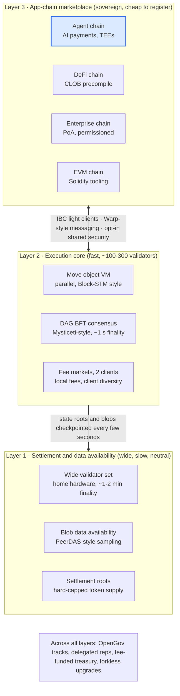
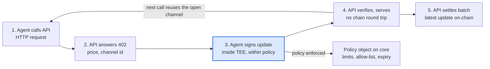

# Foliant Whitepaper v0.1

28 September 2026 · Gareth Oyston, Machine Quotient Ltd

Draft for review. Machine Quotient Ltd.

## Abstract

Foliant is a three-layer blockchain network designed for machine-to-machine and human-to-machine value transfer. A wide, slow settlement layer provides neutral finality and data availability; a fast execution core with an object-centric Move virtual machine and DAG-based Byzantine fault-tolerant consensus provides \~1 s finality and parallel execution; a marketplace of sovereign app-chains, connected by light-client interoperability, provides specialisation without fragmenting security. Foliant's native contribution is the **agent account**: an on-chain account object whose keys can live inside attested trusted execution environments, whose spending is bounded by on-chain policy, and which can open streaming payment channels that settle HTTP-level metered requests at sub-cent cost. Governance is track-based and on-chain, with a treasury funded from fees rather than inflation, and a hard-capped native token, FOL. The design borrows deliberately from Bitcoin, Ethereum, Cardano, Polkadot, Solana, Avalanche, Cosmos, Sui, Aptos, Near and Hyperliquid, and states for each borrowed component what was given up to obtain it.

## 1. Motivation

Software agents are becoming economic actors, and no existing network was designed with them as first-class users. An agent that calls an API ten thousand times an hour needs an account it can hold without a human key ceremony, a spending limit its operator can enforce cryptographically rather than contractually, and a way to pay a fraction of a cent per call with finality measured in the time of a network round trip. Card rails cannot do this; the agent-payment protocols emerging in 2025-26 (HTTP 402 metering, agent payment protocols from exchanges and card networks) run on general-purpose chains that treat an agent as an ordinary externally owned account.

The chains of the last decade each solved one part of the problem. Bitcoin proved neutral settlement; Ethereum proved programmable money and a rollup-centric scaling path; Solana, Sui and Aptos proved that parallel execution and sub-second BFT finality are practical; Cosmos proved trust-minimised interoperability through light clients; Avalanche proved that sovereign chains can be cheap to launch; Cardano and Polkadot proved that a protocol can govern and fund itself on-chain. None combined them, because several of these properties are in tension inside a single layer. Foliant's premise is that they can be combined across layers, and that the agent economy is the workload that justifies doing so.

Three observations shape the design:

1. **Capacity is no longer scarce.** Chains with six-figure theoretical throughput run at a few hundred transactions per second of real demand. A new network must win on a workload, not on a benchmark.
2. **Security and speed live in different validator sets.** Sub-second finality needs a small, well-provisioned validator set; credible neutrality needs a large, cheap one. A network that wants both must checkpoint the fast set into the slow one.
3. **Interoperability is a standard, not a feature.** Multisig bridges have lost more user funds than any other component. Light-client verification (IBC) is the only bridge design with a security argument, and it now reaches chains without native light clients through attestation.

## 2. Design principles

1. **One property per layer.** Each layer optimises for exactly one of neutrality, speed or sovereignty, and the layers are coupled by verifiable commitments rather than shared state.
2. **Borrow production components; invent only the agent layer.** Consensus, VM, data availability and interoperability are taken from open-source systems with years of mainnet operation. Novel code is confined to agent accounts, payment channels and their integration.
3. **No single client.** The execution core launches with two independent client implementations; a bug in one cannot halt the network.
4. **Light clients or nothing.** All cross-chain messages are verified by light clients (or attested light clients where the counterparty chain has none). There are no multisig bridges.
5. **Deterministic cost before submission.** Transactions declare the objects they touch, so fees and outcomes are known before broadcast, as in extended-UTXO systems. A transaction whose declared set is complete skips optimistic execution entirely.
6. **Fees fund the protocol; inflation does not.** Treasury income is a fixed fraction of fees. Issuance is a decaying staking subsidy that reaches zero.
7. **Governance is on-chain, bounded and slow.** Parameter changes and upgrades pass through tracks with delays proportional to their blast radius; a constitutional committee can veto but not propose.
8. **Formally verify what cannot be patched.** Settlement consensus and the token contract are formally verified; everything else is audited and upgradable.
9. **Post-quantum at genesis.** Every signature scheme in the protocol is versioned and replaceable by runtime upgrade, and the keys that cannot be rotated quickly (settlement validator keys, account recovery keys) use a hash-based post-quantum scheme from the first block. No live chain has yet migrated its signatures; Foliant avoids having to.
10. **Speak the standards agents already use.** The agent layer exposes HTTP 402 (x402) and the Machine Payments Protocol rather than a Foliant-only format, so an agent built for Coinbase's or Stripe's rails pays on Foliant without a new client.

## 3. Architecture overview

Foliant consists of a settlement layer (L1), an execution core (L2) and an app-chain marketplace (L3), with one token and one governance system spanning all three.



A transaction on the execution core is final in about one second under the core's own BFT consensus. Every few seconds the core's validators post a state root and the block data as blobs to the settlement layer; once the settlement layer finalises that checkpoint (1-2 minutes), the core's history up to that point is irreversible even if the core's validator set is later compromised. App-chains relate to the core the same way the core relates to settlement: they may post checkpoints to the core (and so inherit its finality) or run fully sovereign and connect by IBC only.

Users and agents interact almost entirely with the core and app-chains. The settlement layer holds the canonical FOL ledger, staking records and checkpoints; it exposes a minimal transaction set (transfer, stake, checkpoint, governance vote) and no general-purpose smart contracts.

## 4. Settlement layer

The settlement layer is optimised for the number and independence of its validators, not for speed. Its design target is thousands of validators on consumer hardware with residential bandwidth.

**Validators and staking.** Proof-of-stake with a low minimum bond (target: an amount a hobbyist can reach) and a maximum effective balance per validator to force large stakers to run many keys, as Ethereum does. Nominated staking (Polkadot NPoS) lets token holders back validators without running hardware; the election algorithm maximises the stake behind the least-backed elected validator, which flattens stake concentration.

**Consensus.** A slot-and-epoch protocol in the Ouroboros/Gasper family: a random leader proposes each slot's block, validators attest, and a checkpoint is finalised when two-thirds of stake has attested to it across two epochs. Slot time 6 s, epoch 32 slots, finality \~1-2 min. This protocol is the one component to be formally verified, because its safety cannot be patched after the fact. Slashing applies to double-proposal and surround-voting; inactivity leak reduces the stake of validators who stop attesting during a non-finalising period so that finality resumes.

**Data availability.** Blocks carry blobs: the execution core and checkpointing app-chains post their transaction data as erasure-coded blobs, and validators verify availability by sampling (PeerDAS-style) rather than downloading everything. Blobs are pruned after a retention window (18 days initially); their commitments remain forever. This gives the fast layers Ethereum-grade data availability without requiring settlement validators to execute the fast layers' transactions.

**Transaction set.** Deliberately minimal: FOL transfer, stake and unstake, nominate, submit checkpoint, submit blob, governance vote and referendum. No general smart contracts. This keeps the client small, the attack surface narrow and the hardware bar low.

**Checkpoints.** A checkpoint from the execution core is a signed state root plus blob references from at least two-thirds of core stake. The settlement layer verifies the signature set against the core validator registry it holds, and stores the root. A checkpoint that conflicts with an earlier finalised one is rejected and the signing core validators are slashed on the settlement layer, where their stake is held.

## 5. Execution core

The execution core is where applications and agents live. It adopts the object model and consensus of Sui and the optimistic parallel scheduler of Aptos, with Solana's local fee markets.

**Object model.** State consists of objects, each with an owner and a version. Owned objects can be mutated only by their owner; shared objects can be mutated by anyone under the rules of their defining Move module. A transaction declares the objects it reads and writes. Transactions touching only owned objects are causally independent of everything else and take the *fast path*: they are certified by a two-thirds quorum of validators without ordering through consensus, and finalise in a few hundred milliseconds. Transactions touching shared objects are ordered by consensus.

**Virtual machine.** Move, in its object-centric dialect. Move's linear resource types make assets un-duplicable and un-droppable at the language level, which matters when agents hold funds. Modules are upgradable under an on-chain policy set at publish time (immutable, owner-upgradable or governance-upgradable).

**Parallel execution.** Consensus-ordered transactions are executed with a Block-STM scheduler: all transactions in a block run optimistically in parallel, conflicts are detected from the declared read/write sets, and conflicting transactions re-execute in order. Declared sets bound the worst case and make fees predictable.

**Consensus.** A DAG-based BFT protocol in the Mysticeti family: every validator proposes blocks each round, blocks reference earlier blocks, and commitment is decided by the structure of the DAG rather than by explicit voting messages. Three message delays to commit; \~0.5-1 s finality in practice. Validator count 100-300, weighted by FOL stake delegated on the settlement layer.

**Fee markets.** Fees have a base component (burned in part, sent to treasury in part) that adjusts per block to target 50% utilisation, plus a *local* component per contended shared object, so a popular auction raises the price of touching that object without raising the price of an unrelated transfer. Fees are denominated in FOL, but a transaction may name a **paymaster**: a registered contract that accepts a whitelisted stablecoin from the sender and pays the FOL fee itself, so payments users never hold the volatile asset (the model Circle's Arc uses with USDC as gas). The paymaster buys and burns FOL, so the fee split in §9 is unchanged. A **zero-fee lane** carries settlement of whitelisted assets (initially the network's reference stablecoins and channel settlements) at no cost to the sender, funded from the treasury and capped per account per hour; transactions over the cap fall back to the normal fee market. This follows Plasma's subsidised transfer path and exists so that an agent's first payment costs nothing to set up.

**Two clients.** The core ships with two independently implemented validator clients (working assumption: one derived from the Sui reference implementation in Rust, one written from the specification in Go or Zig). No client may exceed two-thirds of stake; delegation programmes and rewards are weighted to enforce this.

**Order-book precompile.** A native central limit order book, in the manner of Hyperliquid's HyperCore, is exposed as a shared object with a native matching engine. Move contracts read and place orders on it directly, removing the oracle hop that on-chain derivatives otherwise need. Orders are submitted **sealed**: encrypted to a threshold key held by the current validator committee and decrypted only after the block's order set is fixed, then matched in a batch per small block (the Penumbra pattern), so no party can see or front-run an order before it is committed. Any value the matching engine captures from price improvement in a batch is **rebated to the resting liquidity** on that book rather than to the proposer, as Unichain's verifiable block building does for its liquidity providers.

**Dual block cadence.** Small blocks every \~0.5 s carry transfers, channel updates and order-book operations; large blocks every \~30 s carry heavy computation such as proof verification, so that verifying a zkML proof does not delay a payment.

## 6. Agent accounts and payment channels

This section is the part of Foliant that §11a does not find elsewhere in combination. An agent account binds three things: a key that may live inside an attested enclave, a spending policy enforced at the ledger and arranged in a tree so that a crew of agents shares one bound, and a set of payment channels and pools that let agents pay per request without touching the chain for every call. It is specified here for the sovereign chain's runtime; the reference implementation and the first deployments implement the same state machines as contracts on existing chains.

**6.1 Account object.** `AgentAccount { owner: address, signer: KeyRef, policy: PolicyRef, attestation: Option<Attestation>, channels: vector<ChannelRef>, nonce: u64, parent: Option<AccountRef> }`. The `owner` is the principal (a person or organisation) who created the agent and can rotate or revoke it. The `signer` is the key the agent uses day to day. The account is an owned object of the owner but is *operated* by the signer: transactions signed by the signer are valid only if they pass the policy check.

**6.2 Attestation.** The signer key may be generated inside a trusted execution environment (Intel TDX, AMD SEV-SNP, AWS Nitro). The enclave produces a remote attestation quote binding the key to a measured code image; the quote is verified by a native precompile and stored in the account. Counterparties can then require that payments come from a key that provably lives inside known agent code. Attestation is optional: an account without one is simply a policy-bounded hot wallet. TEE trust is hardware trust, so attestation is a signal, not a guarantee; policy limits bound the loss if an enclave is broken.

**6.3 Spending policy.** `Policy { per_tx_max, per_window_max, window_secs, allow_list: Option<vector<address>>, deny_list, expiry, escalation: Option<address> }`. The policy is checked by the runtime before execution, not by a contract, so it cannot be bypassed by calling a different module. Transactions over the limit fail unless co-signed by the `escalation` key (typically the owner). Policies are objects, so an organisation can share one policy across many agents and change it in one transaction. The policy bounds *committed* value: a deposit into a channel or pool is the spend the policy sees, and the off-chain updates that draw on it need no further budget check.

**6.3a Hierarchical budgets.** Accounts form a tree. An account's signer may **delegate**: create a child account with its own signer and a policy that sits within the parent's on every axis (caps no larger, allow-list a subset, deny-list a superset, expiry no later), and move funds to it. Delegation is a signer operation, not an owner one, so an orchestrating agent can give each worker in its crew a budget without a human in the loop. Three rules make the tree a guarantee rather than a convention:

1. *Value leaving the tree is checked against every ancestor.* A transfer, channel deposit or pool deposit from any account is checked against that account's policy and against the policy of every ancestor up to the root, each with its own spend window, and is recorded in every one of those windows, all or nothing. A child's policy is therefore never the only bound on it; if a parent is tightened after delegation, every descendant is bound at the next spend.
2. *Moves inside the tree are not spends.* Funding a child and recalling a descendant's balance are not policy-checked and are not recorded, because the value has not left the tree. Money can sit anywhere in the tree; it can only leave through a policy.
3. *Any ancestor administers any descendant.* The signer of any ancestor may set a descendant's policy, rotate its signer, or recall its funds, from any depth. An orchestrator revokes a misbehaving worker with one transaction; a fleet operator recalls a project's unspent balance without going through the department that created it.

The reference implementation enforces all three at the ledger and tests them, including a property test over random trees that no subtree ever commits more than its root's `per_window_max`. The enclave-side signer enforces its own account's policy; the aggregate is a ledger check, since only the ledger sees every branch.

**6.4 Payment channels.** A channel is a shared object `Channel { payer: AgentAccount, payee: address, deposit: Coin, balance_to_payee: u64, seq: u64, timeout }`. Opening deposits funds; each off-chain update is a signed tuple `(channel_id, seq, balance_to_payee)` where the balance only increases. The payee may settle any time by submitting the latest update; the payer may close by submitting its latest update and waiting `timeout` for the payee to submit a higher one. Channel updates are signed under the agent's policy: the enclave refuses to sign an update that would breach `per_window_max`. Settling a channel is an owned-object transaction on the payee's side and takes the fast path.

**6.5 Metering flow.** The flow follows the HTTP 402 convention used by x402 and similar protocols, so any HTTP API can be metered with a middleware and no chain-specific client.



Steps 1-4 involve no chain interaction and complete within the latency of the API call itself. Step 5 happens whenever the API chooses (every N calls, every hour, or when the channel nears its deposit). One on-chain transaction settles thousands of calls, so the per-call cost is the amortised fee divided by N, far below a cent.

**6.6 Streaming.** For continuous services (inference tokens, compute-seconds, data feeds) a channel may carry a rate rather than discrete updates: `(channel_id, rate_per_sec, start_ts)` signed once; the payee's claimable balance is `rate × (now − start)` until either side sends a stop. This is the Sablier/Superfluid pattern moved into the channel layer so the stream itself never touches the chain.

**6.7 Discovery and reputation.** Agents and APIs register service descriptors (price, unit, attestation requirements) as objects; a payee can require a minimum attested code hash, a payer can require a payee's settlement history. Reputation is the set of settled channels, which is public and unforgeable.

**6.8 Interaction with verifiable inference.** A channel update may carry a commitment to the request and response; a payee that later submits a zkML or opML proof against that commitment can claim a bonus or defend against a dispute. Foliant does not mandate proofs; it makes them attachable.

**6.9 Wire compatibility.** The Agent chain implements two external standards as first-class request formats: the HTTP 402 flow of x402, and the Machine Payments Protocol that Tempo launched with Stripe in March 2026. A payee's 402 response may carry Foliant channel terms alongside x402 or MPP terms, and the Foliant middleware accepts any of them. This makes Foliant a settlement option inside the rails that Coinbase and Stripe are standardising rather than a competing rail.

**6.10 Pooled channels.** A dedicated channel per agent-payee pair does not scale to one API serving thousands of agents. Foliant adds a **pool**: a shared object funded by many payers, coordinated by the payee (or a third-party operator), in which each payer holds an individually signed, unilaterally exitable claim, following Bitcoin's Ark construction. A payer joins a pool with one on-chain transaction, pays inside it off-chain exactly as in a channel, and can exit at any time by submitting its latest claim and waiting the timeout; the coordinator settles the pool periodically with one transaction. If the coordinator disappears, every payer's exit path still works. Pools reduce per-agent on-chain setup from one transaction per counterparty to one per pool.

**6.11 Compute and data market objects.** The chains built for AI workloads in 2025-26 (Ritual, 0G, Sahara, Story) converge on three primitives that Foliant standardises as object types on the Agent chain rather than as its own applications: a `ServiceOffer` (price, unit, attestation requirements, model or dataset identifier), a `Receipt` (a channel update that commits to request and response hashes, optionally with a zkML or opML proof reference), and a `Contribution` (a data or model contribution with a licence and a royalty split that cascades to derivatives, in the manner of Story's IP graph). Marketplaces, verifiers and licensing services are then applications over shared objects, and any of them can be replaced without changing the protocol.

## 7. App-chain marketplace and interoperability

App-chains give Foliant specialisation without forcing every application onto the core's validator set or VM. The marketplace follows Avalanche9000's economics and Cosmos's connectivity, with Polkadot's shared security as an option.

**Registration.** Any chain registers on the settlement layer by paying a continuous fee in FOL (order of a few FOL per month, set by governance) and publishing its genesis, validator set and light-client type. There is no slot auction and no per-validator bond on the settlement layer. Registration gives the chain a name in the network registry and the right to open IBC connections to the core and to other registered chains.

**Security models.** A registered chain chooses one of three:

- *Sovereign*: its own validators and stake; Foliant verifies it by light client only. Cheapest, least secure.
- *Checkpointed*: its own validators, but state roots are posted to the core and become irreversible once the core checkpoints to settlement. Protects against long-range attacks on the app-chain.
- *Shared security*: validators are drawn from core stake that has opted in, and are slashed on the settlement layer for misbehaviour on the app-chain. The app-chain pays rent in FOL to the validators who secure it, priced by a continuous auction as in Polkadot's coretime market.

**Virtual machines.** App-chains choose their execution environment: Move (sharing tooling with the core), EVM (for Solidity teams and existing contracts), CosmWasm, or a custom VM. An EVM app-chain with shared security is the expected path for most DeFi teams migrating from Ethereum L2s.

**Interoperability.** All cross-chain messaging is IBC. Between Foliant chains, light clients verify counterparty consensus directly. To chains without cheap light clients (Ethereum L1, Solana, Bitcoin), Foliant uses attested light clients: a set of attestors runs full nodes inside TEEs and signs headers, and the attestation quotes are verified on-chain. This is weaker than a native light client and stronger than a multisig; attestors are bonded in FOL and slashed for signing conflicting headers. Token transfers use mint-and-burn (IBC IFT) rather than wrapped vouchers, so an asset has one canonical form across the network. General message passing (IBC GMP) lets a contract on one chain call a contract on another with a delivery proof.

**Warp-style fast messaging.** Between chains that share security, messages are additionally relayed by the shared validator set with BLS-aggregated signatures, giving sub-second cross-chain calls without waiting for light-client header verification. The IBC path remains the fallback and the source of truth.

## 8. Governance

Foliant is governed on-chain by FOL holders through tracks whose delay and threshold scale with the blast radius of the decision. The design follows Polkadot OpenGov and Cardano CIP-1694.

**Tracks.** Every referendum is filed on a track. Initial tracks: *treasury small* (≤ 0.1% of treasury, 3-day vote), *treasury large*, *parameter change* (fee targets, registration fee, blob retention), *runtime upgrade* (28-day enactment delay), *emergency* (validator-set or attestor removal, 24-hour vote, requires committee co-sign) and *constitutional* (changes to tracks, thresholds or the committee). Tracks run concurrently; a track may cap its concurrent referenda.

**Voting.** Stake-weighted with conviction: a voter may lock FOL for longer to multiply their weight (up to 6× for a 32-week lock). Approval and turnout thresholds decay over the voting period so that a proposal with broad support passes quickly and a contentious one needs time.

**Delegated representatives.** Holders may delegate per track to a registered representative (DRep). Representatives publish a statement and a voting record; delegation is revocable at any block. This gives Cardano-style participation without requiring every holder to read every proposal.

**Constitutional committee.** A committee of 7-15 elected members holds a veto over runtime upgrades and constitutional changes that violate the written constitution, and a co-sign on the emergency track. It cannot propose. Members serve fixed terms and are elected by FOL holders.

**Forkless upgrades.** The execution core and settlement layer runtimes are deployable as WASM modules approved by referendum; clients load the new runtime at the enactment block. Client software still needs updating for changes below the runtime (networking, storage), which is why two clients and a long enactment delay matter.

**Treasury.** The treasury is a settlement-layer account funded by a fixed share of fees from all three layers (see §9). It spends only through the treasury tracks. Recurring programmes (validator delegation, audits, grants) are approved as bounties with elected curators, so that individual disbursements do not each need a referendum.

## 9. Token economics

FOL is the single staking, fee and governance asset of the network. Supply is hard-capped; staking rewards come from a decaying issuance that reaches zero, after which validators are paid from fees alone. All figures in this section are proposals for the legal and economic review, not commitments.

**Supply.** Maximum supply 1,000,000,000 FOL, fixed in the settlement-layer runtime and changeable only through the constitutional track.

**Issuance.** Staking rewards are issued per epoch on a geometric decay with a half-life of 4 years, from an initial rate equivalent to 4% of genesis supply per year, until cumulative issuance reaches the cap. Cumulative issuance after t years:

```latex
I(t) = I_0 \, \frac{1 - 2^{-t/4}}{\ln 2 / 4}
```

where I₀ is the initial annual issuance. This converges to about 5.8 × I₀, so with I₀ = 4% of genesis supply, total issuance is bounded at roughly 23% of genesis supply, and the cap is set so that genesis allocation plus issuance equals 1,000,000,000.

**Fee split.** Every fee on the settlement layer, the core and shared-security app-chains is split: 50% burned, 30% to the block proposer and attesting validators, 20% to the treasury. Fees paid through a stablecoin paymaster are converted to FOL by the paymaster before the split, so the burn is preserved whatever the sender paid in. The zero-fee lane is paid for by the treasury at the prevailing base fee, with a governance-set annual budget; when the budget is exhausted the lane closes until the next period. Burning offsets issuance; at sustained utilisation the network is net deflationary. Sovereign app-chains keep their own fees but pay registration in FOL, which follows the same split.

**Staking.** Settlement validators bond FOL on the settlement layer; core validators bond FOL on the settlement layer as well, registered to the core. Nominators delegate to either. Unbonding takes 21 days. Slashing: 0.1% for downtime beyond a threshold, 5% for equivocation, up to 100% for a coordinated attack detected by the fraction of stake involved (Ethereum's correlation penalty).

**App-chain rent.** Registration fee and shared-security rent are paid in FOL, streamed per block from the app-chain's registry account. Rent is priced by a continuous auction against available core stake; governance sets floor and ceiling.

**Genesis allocation (proposal).**

| Bucket | Share | Vesting |
| --- | --- | --- |
| Community: airdrop to Agent-chain users, testnet participants, delegation programme | 30% | Airdrop at core mainnet; programmes over 4 years |
| Treasury (governance-controlled) | 25% | Unlocked, spendable only by referendum |
| Core contributors and early team | 18% | 1-year cliff, 4-year linear |
| Investors (pre-seed to Series A) | 17% | 1-year cliff, 3-year linear |
| Foundation operations and validator bootstrap | 10% | 4-year linear |

No public sale is assumed. Whether a token exists before the core mainnet, and in which jurisdictions it may be distributed, is a legal decision addressed in the roadmap.

## 10. Security model and threat analysis

Foliant's security argument is layered: the fast layers may be compromised transiently, but nothing finalised by the settlement layer can be reverted without corrupting more than one-third of settlement stake, and every cross-layer and cross-chain claim is verified by a light client or a bonded attestation.

**Assumptions.** Settlement: fewer than one-third of bonded stake is Byzantine, and the network is partially synchronous. Core: fewer than one-third of core stake is Byzantine for liveness and safety of un-checkpointed blocks; once checkpointed, safety rests on settlement. TEEs: attestation proves code identity but not freedom from side channels; policies bound the loss from an enclave break.

| Threat | Layer | Defence |
| --- | --- | --- |
| Core validators collude to fork after checkpoint | Core / settlement | Checkpoint conflict is detected on settlement; colluding stake is slashed there; the earlier checkpoint stands |
| Core halts (client bug, one-third offline) | Core | Second client; users can force-include transactions via the settlement layer after a timeout; inactivity leak on the core validator set |
| Settlement long-range attack | Settlement | Weak subjectivity checkpoints distributed with clients; 21-day unbonding makes old keys worthless after that window |
| Data withholding by core proposers | Settlement DA | Blobs must pass availability sampling before a checkpoint is accepted; a checkpoint whose blobs are unavailable is invalid |
| Attestor bridge signs a false header | Interop | Attestors bonded in FOL and slashed for conflicting signatures; TEE attestation ties the signing key to audited code; rate limits cap per-hour outflow |
| Agent key compromised | Agent layer | Policy limits are runtime-enforced; the owner revokes the signer; channels close with timeout so a thief cannot drain deposits beyond the policy window |
| Enclave broken (side channel) | Agent layer | Same as key compromise; attestation is advisory, not load-bearing for funds |
| Channel counterparty submits stale state | Agent layer | Monotonic sequence numbers; the honest party submits the higher-sequence update during the timeout |
| Governance capture | Governance | Conviction locking, track delays proportional to impact, committee veto on constitutional changes, treasury spend caps per track |
| Client monoculture | Core | Delegation programme and rewards weighted so no client exceeds two-thirds of stake |
| MEV extraction against agents | Core | Fast-path transactions are not orderable; shared-object transactions use encrypted mempool submission to the proposer (threshold decryption after ordering) |

Three further threats come with the additions in §5 and §6. *Zero-fee lane spam*: bounded by per-account hourly caps and the treasury budget; an account that hits its cap pays normal fees. *Pool coordinator failure or fraud*: every claim is unilaterally exitable with the payer's own signature, so a coordinator can delay settlement but cannot take funds; coordinators are bonded and lose the bond for submitting a stale pool state. *Quantum adversary*: settlement validator and recovery keys are hash-based from genesis; hot keys (agent signers, core validators) use fast classical schemes and are rotated to post-quantum schemes by runtime upgrade under the signature-agility principle before large-scale quantum attacks are practical.

**What is formally verified.** The settlement consensus protocol (safety and plausible liveness), the FOL token module (supply invariants) and the channel settlement logic (no party can claim more than the last co-signed balance). Everything else is audited and upgradable.

**Bug bounty.** A standing programme funded from treasury, with rewards scaled to the layer affected; settlement-layer critical findings pay the most.

## 11. Comparison with existing networks

Foliant matches the fast monolithic chains on execution and the modular ecosystems on interoperability, and adds an agent layer none of them has. What it gives up is simplicity: three layers are harder to build, explain and secure than one.

| Property | Foliant | Ethereum + L2s | Solana | Sui / Aptos | Cosmos | Polkadot | Avalanche |
| --- | --- | --- | --- | --- | --- | --- | --- |
| Finality (user-facing) | \~0.5-1 s core; 1-2 min settlement | 12.8 min L1; L2 soft-confirm instantly | 100-150 ms (Alpenglow) | sub-second | instant (single slot) | \~30 s | \~2 s |
| Parallel execution | yes (object model + Block-STM) | no at L1 | yes | yes | per-chain (BlockSTM arriving) | per-parachain | per-L1 |
| Validator count (fast layer) | 100-300 core; thousands settlement | 1.36M L1 | \~675 | \~86-130 | per-chain | \~600 | per-L1 |
| Independent clients at launch | 2 | 5+ | 2 (Agave/Jito, Firedancer) | 1 | 1 | 1 | 1 |
| Interop standard | IBC + attested light clients | bridges, native L2 bridges | Wormhole | Wormhole | IBC | XCM | Warp |
| App-chain cost | monthly fee | RaaS subscription | n/a | n/a | run own validators | coretime auction | 1-10 AVAX/month |
| Shared security option | yes | yes (rollups) | n/a | n/a | opt-in (ICS) | yes | no |
| On-chain governance and treasury | yes, fee-funded | no | no | partial | per-chain | yes, inflation-funded | no |
| Agent-native accounts and channels | yes | via contracts | via contracts | via contracts | no | no | no |
| Order-book precompile | yes | no | no (app-level) | no | no | no | no |
| Data availability for fast layers | native blobs with sampling | native blobs (PeerDAS) | n/a | n/a | none | relay chain | none |

Relative to Hyperliquid, Foliant trades the 21-validator, 70 ms design for a wider set and a slower but neutral settlement root. Relative to Near, Foliant defers sharding: the object model and app-chains carry the load until dynamic resharding of the core is needed, which the settlement layer's data availability is designed to accommodate.

## 11a. Prior art

Every component of the agent layer has been built before, and as of September 2026 two production systems each hold most of the combination. This section records what was found, so that the claim is not overstated. It is based on a prior-art search conducted on 28 September 2026 and independently re-verified against primary sources the same day, extended in two passes on 3 October 2026; patent databases could not be reached from the search environment and remain unchecked. The first October pass found one item the September search should have caught and did not, and the claim it bears on has been corrected rather than quietly dropped: see Pactra below and §What remains. The second pass searched the Ethereum standards track rather than production chains, where everything before it had been looked for, and found five further drafts, one open x402 issue and one preprint. Three statements this section and §12 had carried since September are corrected as a result, and are marked where they occur rather than removed: the per-transaction cap is no longer unfound, a specification with conformance vectors is no longer a distinguishing practice, and a zero-knowledge construction for policy compliance has been prototyped. The first two are ERC-8427's doing and the third ERC-8366's.

### The two closest systems

**Tempo** (the Stripe/Paradigm L1) is the closest. Three protocol changes, all live on mainnet, together give it a protocol-enforced agent budget and protocol-native channels:

- *TIP-1011, Enhanced Access Key Permissions* (published 4 February 2026, mainnet 27 April 2026): access keys carry per-token spending limits, either one-time or periodic with roll-over, an expiry, call scopes by target and selector, and recipient allowlists for transfers. Checks run in a pre-execution phase and the transaction reverts with `SpendingLimitExceeded` before any user call executes. The proposal names "rate-limited agent/API budgets" as a use case.
- *TIP-1034, TIP-20 Channel Reserve Precompile* (mainnet 9 June 2026): unidirectional payer-to-payee channels as a precompile, with open, top-up, settle, request-close, grace period and withdraw. Unilateral exit is native.
- *TIP-1035, Implicit Approval List* (30 April 2026): puts the channel precompile on a list whose transfers enforce the keychain's spending limits, so a deposit into a channel counts against the key's budget. This is the same rule §6 calls "the policy bounds committed value".

On top of this, Tempo's Machine Payments Protocol (MPP, March 2026) carries channel sessions over HTTP 402, and an IETF-style draft (`draft-tempo-session-00`, 26 September 2026) specifies them. What Tempo does not have, on the sources opened: deny lists; a per-transaction cap separate from the budget; any co-signer or escalation path; settlement of many channels in one transaction (the SDK's `settleBatch` sends one transaction per channel and the precompile has no multi-channel settle); pooled channels shared across payers; and the x402 wire format for sessions (MPP uses its own `Payment` authentication scheme, and its x402 interoperability covers only single-charge `exact` flows).

**The x402 Foundation's `batch-settlement` scheme** (generic and Cloudflare bindings 15 April 2026, EVM 5 May 2026, Solana 21 August 2026) is the closest on the settlement side. Payers deposit into channels and sign cumulative vouchers; the provider's `claimWithSignature` aggregates claims from many channels in one call and `settle` sweeps them to the receiver in one transfer; payers have a timed unilateral withdrawal of 15 minutes to 30 days; the spec names an AI-agent escrow use case. It is deployed as a contract on about ten EVM mainnets and is the settlement layer behind Circle's Nanopayments (mainnet 29 April 2026) and Solana's payment-channels program. It has no spending policy: the x402 v2 spec lists budget management as client-side and out of scope.

### Other prior work

| Prior work | What it did | Relation to Foliant |
| --- | --- | --- |
| Kite AI (whitepaper Oct-Nov 2025, mainnet 2026) | An agent chain describing "standing intents" with per-transaction and daily caps, merchant allow and deny lists, expiry and hierarchical budgets; state channels and x402 compatibility on the roadmap | The same triple on paper; enforcement is by smart-contract accounts and session keys, and the channel and x402 parts were not found in production |
| Cosmos SDK x/authz (2021) | Chain-module enforcement of a spend limit, recipient allow list and expiry on delegated sends | Establishes that runtime-enforced spend grants are old; no periodic window, channels or 402 |
| XRPL payment channels (2017) | Native ledger channels with off-ledger cumulative claims, expiry and either-party close | Establishes that protocol-native channels are old; one payer to one payee, no multi-channel settlement |
| L402 and Lightning Labs agent tools (2020-26) | HTTP 402 plus Lightning channels for metered APIs; scoped macaroons cap spend at the node | The older Bitcoin-side triple; the cap is enforced by the node software, not by consensus, and the format is L402 not x402 |
| Ark (2023) and channel factories (2017) | Pooled shared channels with unilateral exit; one funding transaction for many channels | The pool state machine of §6.10 |
| Coinbase Spend Permissions, Agentic Wallets, AgentCore Payments; Nevermined; Stellar/OpenZeppelin smart accounts; Locus, Payman (2024-26) | Budgets, allow lists and human escalation for agents, enforced in a wallet contract, an enclave or an operator's policy engine, paying over x402 per call | Same allowance model, enforced below the protocol; one settlement per call |
| A402 (arXiv 2603.01179, March 2026); APEX (2604.02023) | Channel settlements aggregated into one transaction through a TEE vault; 402 with middleware policy and batched settlement | Academic designs of the settlement half; no protocol-enforced budget |
| Phala, Oasis ROFL | TEE-attested keys on-chain | The attestation of §6.3 |
| Aptos AIP-103 permissioned signer | Framework-level per-account withdrawal limits with expiry | Rejected August 2026 and removed from the framework |
| Pactra (Zenodo preprint 22833162, 18 September 2026) | Hierarchical on-chain budget enforcement for delegated agents: a mandate tree with a narrowing rule over budget, per-transaction limit, lifetime, concentration and delegation depth, and every expenditure debited from the node's counters and each of its ancestors' | The hierarchical budget of §6.3a, as a design, published ten days before this section's first search and missed by it. Unreviewed single-author preprint; no implementation or deployment found. It carries two policy dimensions Foliant does not have, concentration and delegation depth, and does not state whether tightening a parent binds children that already exist |
| ERC-7710 delegation chains; Haven-AI sub-agent budgets (PR #3444, opened 28 September 2026, open at the time of writing) | An agent re-delegates a narrower budget to another agent as a chain of ERC-7710 delegations, each child's authority field a hash of its parent, with a widening request refused before it reaches a signing payload and revocation cascading to strand the child | Narrowing re-delegation enforced on chain, in a wallet rather than in the protocol, two levels in version one and scoped to a single token and period. Establishes that this is being built on an existing EVM delegation standard rather than on bespoke contracts, which is an adoption argument against Foliant's own contracts rather than against its policy model |
| ERC-8427 Portable Spend Grants (draft 17 September 2026, deployed with a Foundry suite) | An off-chain signed grant from one principal to one named delegate, carrying a per-call cap, a trailing-window cap over `windowSeconds` and a lifetime cap on each of up to sixteen assets, each asset holding its own remaining; an immutable revocation registry that records remaining and never moves funds; a separate executor that debits atomically with the value movement; a canonical text rendering kept byte-identical across implementations; and golden vectors for the domain separator, struct hash, digest, rendering bytes and an EOA signature | The closest published work to Foliant's policy layer as actually deployed, and the item both earlier searches missed. Flat by design: `consume` rejects a redemption by a sub-delegate, and parent-child linkage exists only as an unenforced convention deriving a grant's salt from its parent's hash. No pooling across principals and no per-funder constraint. Its per-asset caps and its conformance vectors are two things Foliant's own roadmap had been treating as contributions; they are the field's baseline from 17 September 2026 onward, and are described as such below |
| ERC-8312 Bounded Agent Actions (thread opened 23 June 2026, inactive since 24 June) | An interface for recording and reading an agent's cumulative spend against a declared bound, per scope | Accounting, not enforcement, and the draft is explicit: the interface "does not, on its own, make a bound impossible for the principal's own key to bypass", and needs an external substrate to enforce one. A hierarchical profile was raised in the thread and never written. This supports §6.3a rather than displacing it: the distinction Foliant rests on, a check before value moves, is one the nearest interface draft draws itself |
| ERC-8366 Zero-Knowledge Spending Policies (pull request 1929, 5 August 2026) | A zero-knowledge proof that one payment satisfies a policy whose parameters stay private, with the agent as prover | Single-use by construction. Its rationale records that multi-payment budgets "require monotonic spent-state advanced outside the view-only signature check; they are deliberately out of scope for this ERC and are expected to build on it" — a written invitation to the cumulative, tree-shaped case of §6.3a |
| ERC-8354 Confidential Agent Policy Verdicts (merged 16 July 2026); ERC-8150 Zero-Knowledge Agent Payment Verification | A zero-knowledge allow or deny verdict against a policy never disclosed on chain, bound to an ERC-8004 identity with an expiry and a nullifier; and verification of a payment against a per-batch user-signed intent by matching calldata | The private-policy half of the second open problem in §12, for one action or one batch at a time. Neither carries cumulative state, so neither proves a budget. Their existence does make §12's statement that no such construction had been prototyped untrue as written, and it is corrected there |
| x402 issue #3646, `agreement-session` (opened 1 October 2026, no maintainer response at the time of writing) | A proposal to bind repeated x402 payments to one agreement session identifier | Adjacent, and weaker than its summary suggests: budget and expiry are explicitly left to the application, and it introduces neither a prepaid balance nor an authorise-maximum, settle-actual flow. Relevant as session binding, not as a budget proposal |
| Zhu and Wang, *Fault-Tolerant Budget Conservation in Distributed Multi-Agent Delegation* (arXiv 2610.00349, 29 September 2026) | Budgets as exclusive escrow credits moving through a delegation DAG, with proofs of an ownership partition and of descendant non-amplification across crash and restart; names the aliasing of one lineage by DAG joins as a hazard the model handles | The nearest theoretical treatment of §6.3a's invariant, and possibly a stronger one than §12 assumes. Only the abstract could be read, the full text having been rate-limited, and the abstract does not restrict the result to a single funding root. If joins from several roots are covered then the conservation result is theirs, and what is left to Foliant is revocation, attribution of a spend back to the funder that paid for it, and per-funder constraints, none of which the abstract mentions. Recorded as unresolved, and claimed in neither direction, until the full text is read |

### What remains

No single deployed system was found that has all of: a spending policy enforced by the execution runtime, settlement of many payers' channels or a shared pool in one transaction with unilateral exit for every payer, and the x402 wire format. Tempo has the first and native channels but settles one channel per transaction under its own wire format; the x402 batch-settlement scheme has the second and third with no policy layer. The gap between them is narrow, both are public, and a reviewer would reasonably call combining them obvious. The elements of Foliant's policy that were not found anywhere at protocol level are the deny list and the escalation co-signer. The per-transaction cap alongside the window cap was in that list until 3 October 2026 and has been taken out of it: ERC-8427 carries a per-call cap, a trailing-window cap and a lifetime cap on every asset in a grant, enforced at its registry, which is the same combination §6.3 specifies for one account. The hierarchical budget of §6.3a is not among them, and an earlier version of this section said it was. Pactra sets out the same mandate tree, the same narrowing rule and the same debit-every-ancestor mechanism as a design, and it was published ten days before the search that missed it; Haven-AI implements narrowing re-delegation on chain over ERC-7710. Tempo's access keys remain one level deep and Kite describes hierarchy in contract accounts, so the claim was wrong about the literature rather than about those two. What this search did not find anywhere is narrower and should be stated as such: a parent tightening its own budget binding children that already exist, at once and without revoking them, rather than at their next renewal; and the hierarchy being fixed by a specification with conformance vectors that more than one independent implementation is tested against. The second half of that needs a qualification it did not need in September. A specification with golden vectors is no longer a distinguishing practice in this space, because ERC-8427 publishes them for the domain separator, the struct hash, the digest, the canonical rendering and a signature, and makes the same argument for them that Foliant's own `docs/spec/spending-policy.md` makes. What is unoccupied is vectors over a *tree* — a case 8427 excludes at the interface, since it refuses a redemption by a sub-delegate — not vectors as such. The pooled channel shared across many agents was not found in any 402 system. Nor, in anything found at any level, was the case that follows from it: a budget funded by several principals at once, where each funder's own constraints are enforced on every spend, one funder's exhaustion does not strand another's children, and a spend can be attributed back to the funder whose money paid for it. Tempo's keys, Pactra's mandates, Haven-AI's chains and ERC-8427's grants all descend from exactly one principal, and 8427 forecloses the alternative structurally rather than by omission. This is the narrowest and best supported of the claims in this section, and it is the one to lead with.

Foliant's position, stated plainly: it is an integration of published parts, not a cryptographic advance. Its value, if any, lies in being an open, neutral protocol that does the whole of this, speaks x402 unchanged, and runs on the chains agents already use, with a runtime-native form available if adoption ever warrants a chain of its own, rather than a payments company's chain with its own protocol. That is a positioning and governance argument, not a novelty claim, and the authors make none beyond it.

## 12. Status and roadmap

**Deployed (30 September 2026).** The agent layer of §6 is live as contracts on Avalanche Fuji (chain 43113): `AgentAccounts` at [`0xDB6940FBD9Dcf8AAD1aBB521B4b6790D0b579c92`](https://testnet.snowtrace.io/address/0xDB6940FBD9Dcf8AAD1aBB521B4b6790D0b579c92), `PaymentChannels` at [`0xa857d5EF74F63fd10BD786bf2d66EaA53736c976`](https://testnet.snowtrace.io/address/0xa857d5EF74F63fd10BD786bf2d66EaA53736c976), `Pools` at [`0x26665c7Ad0a4272F87D1949745dD4B4743F53662`](https://testnet.snowtrace.io/address/0x26665c7Ad0a4272F87D1949745dD4B4743F53662), deployed at block 58893255 with the module set locked in the same block, so no administrative key remains. The contracts, the Python reference they are ported from, and the EVM backend that runs the 402 flow against them were each reviewed independently as they were written (`contracts/audits/`: three reports, 37 findings, all closed). Two of the findings were defects in the protocol as first specified and are corrected in §6.4 and §6.10 as now written: off-chain updates are ordered by balance, not by a payer-chosen sequence number, since ordering by sequence let a payer make every update a payee held unusable; and a pool claim carries an epoch that increments on each join, since without it an update from an earlier membership replayed against a later deposit.

Measured on Fuji (`docs/fuji-cost-report.md`): opening a channel costs 417,363 gas and settling it 107,087; joining a pool 271,001; the calls between are free of the chain. A session therefore costs about 524,000 gas on the channel route or about 335,000 on the pool route whatever its length, against roughly 75,000 per call for a per-call x402 payment, so Foliant is cheaper from about five to seven calls a session and the saving is over 90 % at a hundred. The reference crew scenario (§6.3a) ran on Fuji with the same figures it produces in the reference: a worker's 100 channel is counted against its own window and its orchestrator's, the provider receives what was signed, and the orchestrator recalls the worker's unspent funding without any of it counting as a spend.

Integrations: `langchain-foliant` (PyPI) is listed in LangChain's integration directory; `elizaos-plugin-foliant` (npm) was published at an ElizaOS maintainer's invitation; a scheme proposal is open with the x402 Foundation (x402#3620) to bind pooled settlement and the spending policy into the standard.

**Roadmap.** The protocol runs on chains agents already use; the composite core of §3–5 follows only if the protocol earns it. Each phase ends at a gate that is a condition, not a date.

1. **Protocol on testnet (done).** This whitepaper; the reference implementation; the contracts on Avalanche Fuji; the x402 scheme; SDKs in Python and TypeScript with LangChain and ElizaOS integrations. Gate: one design partner using it.
2. **Agent chain (months 4-15).** Public testnet with external validators; zero-fee lane and stablecoin paymaster; compute-and-data market objects; two audit rounds on the agent modules and IBC configuration; IBC connection to at least one major ecosystem via an attested light client; mainnet with fees in stablecoins. Gate: audits passed, mainnet live.
3. **Traction and raise (months 15-24).** Paying agents and APIs on mainnet; delegation programme; MPC custody as a second key model; MiCA white paper and UK financial-promotion review if a token is to be distributed; Series A. Gate: Series A closed.
4. **Foliant core and settlement (months 24-42).** Two core clients; settlement layer with formally verified consensus and hash-based validator keys; order-book precompile with sealed orders; Agent chain migrates to become the first app-chain under shared security; app-chain registry opens; FOL genesis and airdrop. Gate: two clients above one-third stake each, audits and verification complete, mainnet.
5. **After mainnet.** Encrypted mempool for all shared-object transactions, shared sequencer service for app-chains, recursive settlement proofs for bridges, optional shielded execution, dynamic resharding of the core as demand requires.

**Open problems, not yet specified.** Two extensions of §6.3a are recorded here as open, with no mechanism claimed. *A budget tree that spans chains:* the tree is enforced because one ledger sees every branch; a crew whose members hold accounts on different chains has no such ledger, and no deployed system enforces an aggregate spending policy across chains. On the theory rather than the deployments, Zhu and Wang's preprint of 29 September 2026 proves conservation for credits moving through a delegation DAG, including the aliasing of a lineage by joins, which is the closest result to the bound the simulation below establishes empirically; only its abstract could be read, so how far it already settles this is recorded in §11a as unresolved. A small neutral chain whose only job is to hold policy trees that other chains' contracts consult is one candidate, and would be the first concrete task for a sovereign Foliant chain. A simulation with two ledgers and an honest in-order relay of delay *d*, specified before it was built and independently audited twice (`sim/` in the repository), establishes the bound: the crew's committed value never exceeds the root cap by more than the amount the remote side applied in the *d* seconds before the last local spend, at most that side's own caps, and at most the sum of all caps minus the root cap; refusal recovers within *d*; with delay long enough for the remote side to fill its own cap the tree reaches twice the root cap, so a design that spans ledgers must either split the cap between them or bind each account to one home ledger. What the simulation does not cover: a relay that lies, drops or reorders; clock skew; channels, pools and streams across ledgers; and it does not itself enforce the one-home-ledger rule, without which a branch funded on both ledgers gets its cap twice. Those are the open parts. *Private budgets:* policies, windows and receipts are public, and an organisation's agent spend is competitive information; enforcing "this spend is within every ancestor's policy" under a zero-knowledge proof over committed policies would remove that leak. The check to be proved is small (a range, a set membership, an expiry). The sentence that stood here until 3 October 2026 said that no construction had been prototyped; that is no longer true and the record is corrected. Three exist on the Ethereum standards track, all of them for a single decision rather than a running total: ERC-8366 proves one payment against a policy whose parameters stay private, ERC-8354 returns an allow or deny verdict against a policy never disclosed on chain, and ERC-8150 matches a payment to a per-batch signed intent. None carries the monotonic spent-state a budget needs, and ERC-8366's rationale says so in as many words while putting that case outside its own scope. So the open problem survives, in a narrower and better-attested form: a proof that a spend is within every ancestor's cap, over committed policies, where the ancestors' totals advance. No construction of that has been prototyped and none is claimed.

## References

Design sources for the components Foliant adopts, all opened 28 September 2026.

- Ethereum roadmap (Pectra, Fusaka, PeerDAS, Glamsterdam): [ethereum.org/roadmap](https://ethereum.org/roadmap/)
- Solana Alpenglow consensus and Firedancer client: [BlockEden, Feb 2026](https://blockeden.xyz/blog/2026/02/26/solana-firedancer-alpenglow-1m-tps/)
- Polkadot JAM and OpenGov: [JAM transition, Sep 2026](https://www.hokanews.com/2026/09/polkadot-prepares-major-jam-transition.html)
- Cardano Leios and Voltaire governance: [cardano.org, May 2026](https://cardano.org/news/2026-05-14-cardano-is-ready-to-grow/)
- Avalanche9000 L1 registration model: [Avalanche support](https://support.avax.network/en/articles/9868736-what-is-avalanche9000); [Etna motivation](https://build.avax.network/blog/etna-upgrade-motivation)
- Cosmos IBC, Attestor light clients, IFT, GMP, BlockSTM: [Cosmos Stack roadmap 2026](https://cosmos.network/blog/the-cosmos-stack-roadmap-2026)
- Sui object model and Mysticeti v2: [sui.io](https://www.sui.io/blog/mysticeti-v2-sui-consensus)
- Aptos Block-STM and AptosBFT: [Chainspect Aptos](https://chainspect.app/chain/aptos)
- Near Nightshade dynamic resharding: [Chainspect Near](https://chainspect.app/chain/near)
- Hyperliquid HyperCore/HyperEVM dual architecture: [CleanSky, 2026](https://cleansky.io/blog/hyperliquid-architecture-hypercore-hyperevm-2026/)
- Bitcoin Lightning capacity trend: [Spark, 2026](https://www.spark.money/research/lightning-network-2026-state)
- L402 protocol: Lightning Labs, lightning.engineering (Aperture); Coinbase Spend Permissions: docs.base.org (smart wallet); ERC-4337: eips.ethereum.org/EIPS/eip-4337
- HTTP 402 agent payments: [Coinbase x402](https://www.coinbase.com/developer-platform/products/x402); [CoinDesk, Mar 2026](https://www.coindesk.com/markets/2026/03/11/coinbase-backed-ai-payments-protocol-wants-to-fix-micropayment-but-demand-is-just-not-there-yet)
- Regulatory context: [FCA cryptoasset regime](https://www.fca.org.uk/firms/new-regime-cryptoasset-regulation); [Skadden, Jul 2026](https://www.skadden.com/insights/publications/2026/07/fca-finalises-core-rules-for-the-uk-cryptoasset-regime); [MiCA status, Apr 2026](https://binar.com/insights/mica-april-2026-eu-crypto-market/); [CLARITY Act status](https://www.kucoin.com/blog/en-2026-clarity-act-the-lastest-status-and-update)

Sources for the additions of 28 September 2026:

- Tempo Machine Payments Protocol: [CoinDesk, Mar 2026](https://www.coindesk.com/tech/2026/03/18/stripe-led-payments-blockchain-tempo-goes-live-with-protocol-for-ai-agents)
- Arc, USDC as gas, mainnet 16 Sep 2026: [arc.io](https://www.arc.io/blog/arc-mainnet-goes-live-on-september-16-2026)
- Plasma zero-fee stablecoin transfers: [plasma.org](https://www.plasma.org/company/blog/plasma-mainnet-beta-and-xpl)
- Ethereum Lean consensus, hash-based signatures: [HackMD, 2026 plan](https://hackmd.io/@tcoratger/ryS1ElrWbx); Naoris post-quantum L1: [The Quantum Insider, Apr 2026](https://thequantuminsider.com/2026/04/01/naoris-protocol-launches-mainnet-introducing-post-quantum-layer-1-blockchain/)
- Ika 2PC-MPC custody: [sui.io](https://www.sui.io/blog/ika-dwallet-mpc-network-interoperability)
- Fuel declared access lists: [Fuel docs](https://docs.fuel.network/docs/fuel-book/the-architecture/the-fuelvm/)
- Namada shielded pool: [namada.net](https://namada.net/blog/namada-mainnet-is-live); Zama FHE: [docs.zama.org](https://docs.zama.org/protocol/protocol/overview); Aztec: [Road to Mainnet](https://aztec.network/blog/road-to-mainnet)
- Linera microchains: [linera.dev](https://linera.dev/protocol/overview.html); Sei Giga: [Everstake](https://everstake.com/resources/blog/sei-giga-upgrade-50x-faster-execution-for-the-evm-era); MegaETH: [megaeth.com](https://www.megaeth.com/); Monad: [monad.xyz](https://www.monad.xyz/announcements/parallel-execution-monad)
- Ark, Unichain, Penumbra, Ritual, 0G, Sahara and Story were reviewed from secondary coverage; primary documentation to be confirmed in the specification phase.

Sources for the additions of 3 October 2026. The first pass: Pactra, Zenodo preprint 22833162; Haven-AI pull request #3444. The second pass, all opened 3 October 2026:

- ERC-8427 Portable Spend Grants: [github.com/tankcdr/erc-spend-grants](https://github.com/tankcdr/erc-spend-grants) (draft, README and golden vectors read from the author's repository); discussion thread: [ethereum-magicians.org/t/29776](https://ethereum-magicians.org/t/erc-8427-portable-spend-grants/29776), cited from the draft's `discussions-to` field and not opened
- ERC-8366 Zero-Knowledge Spending Policies: [ethereum/ERCs pull request 1929](https://github.com/ethereum/ERCs/pull/1929/files)
- ERC-8312 Bounded Agent Actions: [ethereum-magicians.org/t/28851](https://ethereum-magicians.org/t/erc-8312-bounded-agent-actions/28851), full thread
- ERC-8354 Confidential Agent Policy Verdicts, ERC-7710, ERC-8001 and ERC-8183: read from a clone of [ethereum/ERCs](https://github.com/ethereum/ERCs). ERC-8150 Zero-Knowledge Agent Payment Verification: [ethereum-magicians.org/t/27665](https://ethereum-magicians.org/t/erc-8150-zero-knowledge-agent-payment-verification/27665), title only
- x402 `agreement-session`: [x402 issue #3646](https://github.com/x402-foundation/x402/issues/3646). Issues #3620 and #2641 could not be opened from the search environment and are unread
- Zhu and Wang, Fault-Tolerant Budget Conservation in Distributed Multi-Agent Delegation: [arXiv 2610.00349](https://arxiv.org/abs/2610.00349), abstract only; the full text was rate-limited
- Reported demand for the invariant of §6.3a: [x402-mcp-bridge issue #10](https://github.com/hpp-io/x402-mcp-bridge/issues/10), whose title reports that a "daily-spend cap can be exceeded by concurrent payments (check and record straddle the settle await)"; and [OPTN Labs x402-bch issue #3](https://github.com/OPTNLabs/x402-bch/issues/3). Both are cited from their titles and were not opened

The companion study with feasibility and costs: Composite Blockchain Study — Design, Feasibility & Costs (28 Sep 2026).
