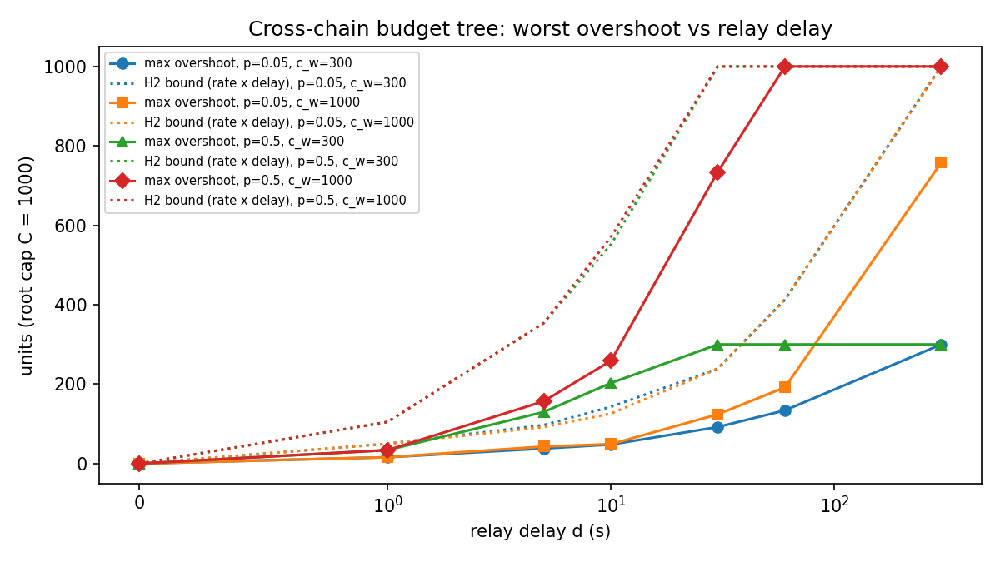

# Cross-chain budget tree: results

29 September 2026. Specification: `SPEC.md` v1.3. Code: `crosschain.py`. Data:
`results.csv` (2,240 runs), `RESULTS-auto.md`, `overshoot.png`. Independent
audits: `AUDIT-1.md` (on spec 1.2 and the first sweep), `AUDIT-2.md` (on the
fixes and this sweep), both reproduced unedited.

## The claim, as supported

Under these assumptions:

- two ledgers running the unmodified reference tree code;
- an honest, lossless, in-order relay that delivers every spend to the other
  ledger exactly `d` seconds after it was applied;
- one shared clock;
- each branch of the crew spending on one ledger only, through `transfer`;

the crew's committed value never exceeds the root's cap `C` by more than the
amount the other ledger applied in the `d` seconds before the last local
spend. That amount is at most the largest the remote side applied in any
interval of length `d` (`bound_rate`), at most `min(C, the remote side's own
leaf caps)`, and at most the sum of all leaf caps minus `C`. Once a spend is
older than `d` both ledgers have it, so refusal recovers within `d`; the
sliding window then drains over `W`.

The first audit showed this is a theorem given the model (AUDIT-1 §4), so the
simulation's job is to show that the implementation matches the model and that
the bound is tight, not to estimate a probability. Both are shown: every
invariant in SPEC §6 held every second of every run; adversarial traffic
reaches the bound exactly (ratio 1.00 at d ≥ 60, and at d = 1 under
saturating load in the audit's harness); and mutated relays (late, or writing
into the wrong account) are caught by the checks (AUDIT-1 §4, positive
controls).

## Results

| Hypothesis | Runs | Pass |
| --- | --- | --- |
| H1 zero delay is safe | 320 (d = 0) | 320 |
| H2 rate × delay bound, whole-run and per-event | 1,920 (d > 0) | 1,920 |
| H3 cap bounds | 2,240 | 2,240 |
| H4 refusal lag ≤ d | 2,240 | 2,240 |
| H5 H2 at depth 2 with concurrent workers and sub-workers | 960 | 960 |

Worst overshoot by delay (units; C = 1000, W = 600 s):

| d (s) | max overshoot | max overshoot / bound |
| --- | --- | --- |
| 0 | 0 | — |
| 1 | 34 | 0.79 |
| 5 | 157 | 0.90 |
| 10 | 259 | 0.87 |
| 30 | 734 | 0.95 |
| 60 | 1,000 | 1.00 |
| 300 | 1,000 | 1.00 |

The overshoot saturates at C: each ledger caps its own local spends at C, so
with a long enough delay the remote side can commit a full cap unseen and the
tree can reach 2C in total. That is the honest worst case for a two-ledger
crew with no reservation mechanism, and it is why a real design would either
split the cap between ledgers or run the tree on one ledger.

## What this does and does not establish

Established: the design's cross-ledger behaviour is exactly the classic
eventually-consistent bound, overshoot ≤ remote rate × delay, with no
compounding through delegation depth and no dependence on spend pattern beyond
rate. The whitepaper may state that as a specified property with `d` as the
parameter.

Not established: anything about a relay that lies, drops or reorders; clock
skew (a window-membership error, not a delay; SPEC §8); the behaviour of
channel deposits, pools or streams across ledgers; or the "own local caps"
clause beyond one ledger per branch, which the audit falsified for a branch
funded on both ledgers (300 + 300 against a cap of 300). A protocol spanning
ledgers must bind each account to one home ledger. None of this was in scope,
and the whitepaper's open-problems paragraph should say so.

## What changed during the study, and why

Recorded in full in the SPEC change log; summarised here because a reader of
the results should know the hypotheses were not all stated correctly at the
start.

- H4 as first written required committed value to fall within `d` of the last
  spend; that confused relay catch-up with window drain and failed on the
  first smoke run. It was restated as refusal lag ≤ d.
- "d = 0" first allowed same-second concurrency on the two ledgers, giving
  overshoot at zero delay; it was made synchronous. Sub-second concurrency is
  represented by d = 1, which is the honest lower bound for a live system.
- The first audit found that the enclave signer charged its window before the
  ledger decided, throttling traffic after saturation and understating
  overshoot by up to about 12%; that depth-2 runs were identical to depth-1
  runs; that the H2 check was insensitive to a slightly late relay; and that
  the H3 bound could not bind in most cells. All four were fixed and the sweep
  rerun; the magnitudes in the table above are from the corrected run and are
  higher than the first sweep's (686 → 1,000 at d = 60).
- The first audit also found two defects in the library that the simulation
  did not exercise but the whitepaper's §6.3a claim depends on: a child's
  escalation co-signer lifted every ancestor's per-transaction cap, and
  windows were recorded before later validation could fail. Both are fixed
  with regression tests (`tests/test_tree.py`).

## Reproduction

    python sim/crosschain.py            # full sweep, about an hour
    python sim/crosschain.py --quick    # 26 runs, a few seconds
    python -m pytest tests/test_tree.py

Runs are deterministic in (parameters, seed); `results.csv` carries both.
